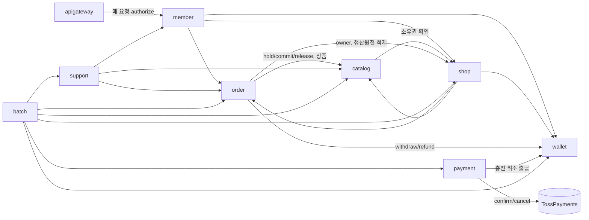
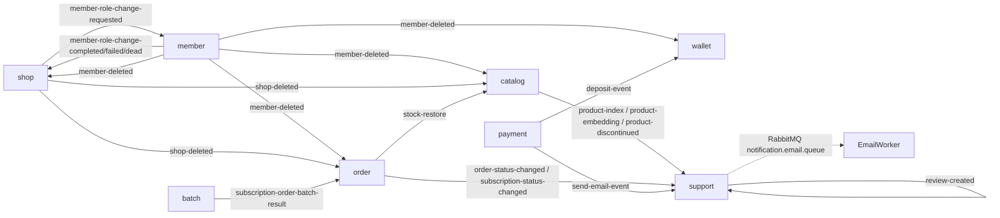
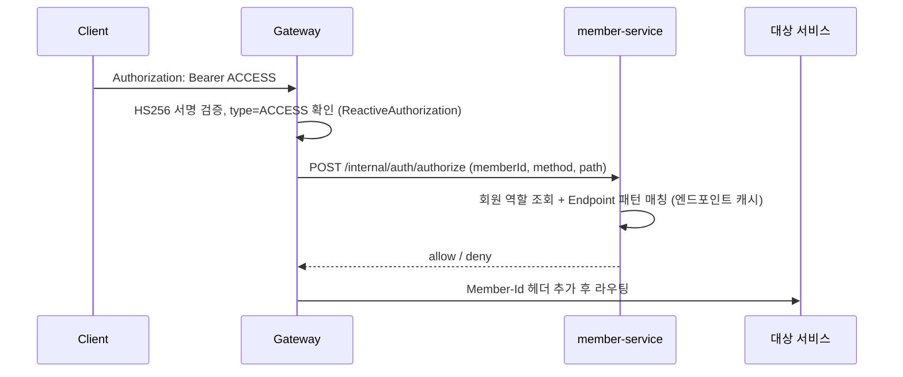

# 01. 서비스 맵

## 1. 서비스 구성

| 서비스 | 포트 | 책임 | 담당(원 프로젝트) |
|---|---|---|---|
| apigateway | 8000 | 라우팅, JWT 검증, 인가 위임, Swagger 통합 | 본인 일부 |
| discovery | 8761 | Eureka | - |
| config | 8888 | Config Server (native, `config/config/*.yml`), local/dev에서만 사용 | - |
| member-service | 8081 | 회원, OAuth(Kakao/Google/Naver), 이메일 인증, JWT 발급, 엔드포인트 인가, 문의, 역할 변경 Saga 참여자 | **본인** |
| shop-service | - | 가게 등록/수정/삭제 Saga 오케스트레이터, 정산 원천/결과 데이터 | **본인** |
| catalog-service | 8082 | 상품, 이미지(S3 presigned), 재고, 재고 예약, 장바구니 | 팀원 |
| order-service | 8083 | 주문, 주문 품목 상태, 구독, 구독 반복 규칙 | 팀원 |
| payment-service | 8088 | Toss 결제(지갑 충전), 충전 취소, Outbox | 팀원 |
| wallet-service | 8084 | 예치금 잔액, 출금/환불/정산 입금/송금, 거래 로그 | 팀원 |
| support-service | 8087 | 리뷰, 검색(ES), 추천(pgvector + OpenAI), 알림(RabbitMQ → 이메일) | 본인 일부 |
| batch-service | 8089 | 정산 잡, 구독 주문 잡, 월간 리뷰 요약 잡, 결제 outbox 정리 | 본인 일부 |

> `run-local.sh`, CI 매트릭스에는 shop-service/batch-service가 각각 누락되어 있음 (`.github/workflows/my-routine-dev-cicd.yml`).

## 2. 인프라

| 구성 | 용도 | 비고 |
|---|---|---|
| PostgreSQL 17 (pgvector) | 단일 인스턴스 `my_routine`, **서비스별 schema** | `ddl-auto: validate`, DDL은 `docs/ddl/*.sql` 수동 관리, member/order는 `sql.init.mode: always` |
| Redis 7 | refresh 토큰, 이메일 인증 코드, 결제 임시데이터, 추천 캐시 | 비밀번호 없음 |
| Kafka (KRaft) | 서비스 간 비동기 이벤트 | 토픽 규칙 `{producer}.{event}.v1` |
| RabbitMQ | 알림(이메일) 작업 큐 | DLQ 없음 |
| Elasticsearch 8 | 상품 검색/자동완성 | security off |
| nginx-proxy-manager | 프록시 + SSL | |

**배포**: EC2 t3.medium 2대 + K3s (master: Spring Cloud + member / worker: 나머지). 현재 활성 CI/CD는 Docker Hub push → SSH로 `docker compose up` (k8s 파이프라인은 `.github/workflows-k8s-backup/`에 비활성). k8s 매니페스트는 replicas 1, HPA/Ingress/PDB 없음, StatefulSet은 hostPath 볼륨.

## 3. 동기 호출(Feign) 의존 그래프

관찰
- **순환 의존**: catalog ↔ shop, member ↔ shop, order ↔ shop.
- **게이트웨이 → member 동기 호출이 모든 요청 경로에 있음** → member 장애 = 전체 장애 (500ms 타임아웃, 실패 시 503).
- batch가 6개 서비스에 동기 의존 + shop schema에 **직접 DB 접속** (`batch-service/.../settlement/batch/ShopDbConfig.java`).

## 4. 비동기(Kafka) 이벤트 그래프

발행 보장 방식

| 발행자 | 방식 |
|---|---|
| shop (role-change-requested), member (completed), payment (deposit, email) | Transactional Outbox + 폴링 |
| shop (shop-deleted), order (stock-restore, status-changed) | `@TransactionalEventListener(AFTER_COMMIT)` — 커밋 후 발행, 발행 실패 시 유실 |
| catalog (product-*) | `@Transactional` 내부에서 직접 발행 — 롤백돼도 이벤트 나감 |
| member (failed, dead) | 직접 발행 |

소비 신뢰성

| 소비자 | 방식 |
|---|---|
| shop, member | `FixedBackOff(500ms, 3)` → `<topic>.dlt`, member는 DLT 소비해 DEAD 이벤트 발행, **shop은 DLT 소비자 없음** |
| order | 3회 재시도 후 `kafka_consumer_failures` 테이블 적재 |
| catalog | `processed_event` 테이블로 멱등 처리 |
| support | 일부 consumer가 manual ack 누락 / 주입 실패 (04-issues 참고) |

## 5. 인증·인가 경로

- JWT에는 memberId만 담고 역할은 member가 판단 → 가게 생성/삭제로 역할이 바뀌어도 토큰 재발급이 필요 없다는 장점 (원 설계 의도).
- 대가: 매 요청 네트워크 홉 + member SPOF. 엔드포인트 캐시로 RPS +16% 개선 실험이 있었음 ([실험 결과](../references/experiments/authorization-endpoint-cache-performance.md)).
- v2에서 이 트레이드오프를 ADR로 재평가한다 (역할 클레임 + 짧은 TTL / 게이트웨이 로컬 캐시 + 이벤트 무효화 등).
