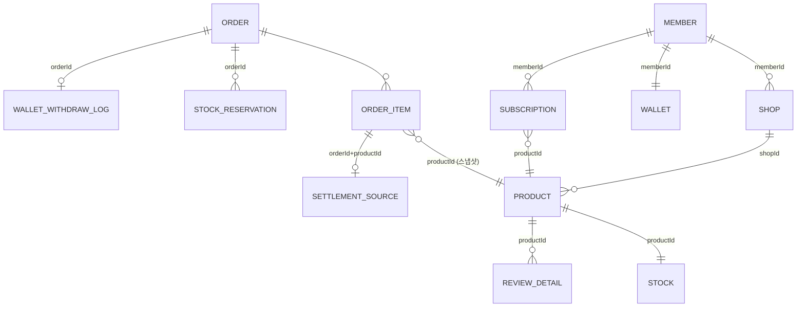

# 02. 도메인 모델 (As-Is)

> 근거: `docs/ddl/*-ddl.sql`, 각 서비스 `domain` 패키지. DB는 단일 Postgres, 서비스별 schema.

## member (schema: member)
| 엔티티 | 핵심 필드 | 비고 |
|---|---|---|
| Member | email, name, nickname, phone, address, `roles`(jsonb Set), status, deletedAt | Role: `USER / SELLER / ADMIN`, Status: `ACTIVE / BANNED / DELETED` |
| OAuth | provider, providerId | Kakao, Google, Naver |
| Endpoint / Role | role → method → path pattern | 인가 정책 테이블 (게이트웨이 authorize의 근거) |
| Inquiry / InquiryAnswer | | 1:1 문의 |
| MemberOutbox | READY → PROCESSING → SENT / FAILED | role-change-completed 발행용 |

⚠ `member.shop`, `member.settlement_source`, `member.settlement_result` 테이블이 DDL에 남아 있음 (shop 분리 이전의 잔재, `docs/ddl/member-ddl.sql`).

## shop (schema: shop)
| 엔티티 | 핵심 필드 | 비고 |
|---|---|---|
| Shop | memberId, shopEmail, shopName, phone, registrationNumber, address, deletedAt | deletedAt은 삭제 Saga가 COMPLETED일 때만 설정 |
| ShopRegistration | (shopId 공유 PK) status, failureCode/Message | `REQUESTED → COMPLETED / FAILED / DEAD` |
| ShopDeletion | (shopId 공유 PK) status, failureCode/Message | `REQUESTED → COMPLETED / FAILED / DEAD` |
| ShopOutbox | eventType, eventKey(memberId), payload, status, retryCount | `READY → PROCESSING → SENT / FAILED` |
| SettlementSource | shopId, orderId, productId, itemAmount, paidAt, status | `PENDING / COMPLETED`, order가 구매확정 품목을 적재 |
| SettlementResult | | batch가 기록 |

⚠ 정산 enum 4개가 `common/src/main/java/com/node5/shopservice/settlement/domain/`에 위치 (공통 모듈에 특정 서비스 도메인 코드).

## catalog (schema: catalog)
| 엔티티 | 핵심 필드 | 비고 |
|---|---|---|
| Product | shopId, name, price, category, thumbnailKey, status | `ON_SALE / HIDDEN / DISCONTINUED` |
| ProductIdempotency | idempotencyKey, status, productId | 상품 생성 멱등 `PROCESSING / COMPLETED / FAILED` |
| Stock | productId(PK), quantity | 조건부 UPDATE로 차감 |
| StockReservation | orderId, productId, quantity, status | `HELD → COMMITTED / RELEASED`, **만료 개념 없음** |
| ProcessedEvent | type + eventId | 소비 멱등 |
| Cart / CartItem | memberId, productId, quantity | |

## order (schema: "order")
| 엔티티 | 핵심 필드 | 비고 |
|---|---|---|
| Order | memberId, orderNum(시퀀스), orderType, subscriptionKey(unique), totalAmount, status, paidAt, recipient | `CREATED / PAID / PAYMENT_FAILED / CANCELED` — **DDL상 PK 제약 없음** |
| OrderItem | orderId, productId, name, imgUrl, unitPrice, totalPrice, quantity, status, settlementStatus | Progress: `PAID → DELIVERY_ING → DELIVERY_COMPLETED → CONFIRMED`, `CANCELED`, `REFUNDED`, (`REFUND_PENDING` 미사용). **shopId 없음** |
| Subscription | memberId, shopId, productId, productName, pricePerItem, quantity, status, nextRunDate, lastProcessedRunDate | `ACTIVE / PAUSED / FAILED / CANCELLED / UNAVAILABLE / TERMINATED` |
| SubscriptionRecurrenceRule | type(WEEKLY/MONTHLY), dayOfWeek / dayOfMonth | |
| KafkaConsumerFailure | | 재시도 소진 메시지 적재 |

관찰
- 주문 상태(Order.status)와 품목 진행 상태(OrderItem.status)가 분리되어 있으나, Order는 PAID 이후 전진하지 않음.
- OrderItem에 shopId가 없어 **가게별 주문 조회/상태 변경이 어려움** (본인 메모 `must.md` #3과 일치).
- 가격은 주문 시점 스냅샷(unitPrice, name, imgUrl)으로 저장되나 그 값의 출처가 클라이언트.

## payment (schema: payment)
| 엔티티 | 핵심 필드 | 비고 |
|---|---|---|
| Payment | memberId, orderId(문자열, 충전 주문번호), paymentKey(unique), amount, method, status | `PENDING / CONFIRMED / PENDING_CANCEL / WITHDRAW_CONFIRMED / CANCELED / PAYMENT_FAILED / MANUAL_PROCESSING_REQUIRED` |
| PaymentOutbox | eventType, payload, status, retryCount | `READY / SENT / FAILED`, 10회 후 포기 |
| PaymentTemporaryData (Redis) | `payment:ready:{orderId}` | 결제 요청 금액 검증용, TTL 10분 |

## wallet (schema: wallet)
| 엔티티 | 핵심 필드 | 비고 |
|---|---|---|
| Wallet | memberId(unique), balance(BIGINT), deletedAt | 모든 변경은 `PESSIMISTIC_WRITE` |
| WalletWithdrawLog | orderId(unique), amount, state | `PAID / REFUNDED` — 주문 결제 멱등 근거 |
| WalletDepositLog | settlementId(unique), amount | 정산 입금 멱등 근거 |
| WalletTransferLog | accountNo, transactionId, amount | 출금(송금), 실제 구현은 Mock |
| WalletTransactionLog | type, groupType, amount, balanceAfter, status, referenceId | type: `ORDER / ORDER_REFUND / SETTLEMENT / TRANSFER / CHARGE / CHARGE_CANCEL` |

관찰: 잔액은 `wallet.balance` 컬럼을 직접 증감하고 로그는 부수 기록 → 잔액과 로그 합계의 정합성을 검증하는 장치가 없음. 로그 테이블이 용도별로 4개로 흩어져 있음.

## support (schema: support)
| 엔티티 | 핵심 필드 | 비고 |
|---|---|---|
| ReviewDetail | productId, memberId, rating, body, likeCount, embedding vector(1536), deletedAt | embedding `NOT NULL`인데 비동기로 채움 |
| ReviewStatic | productId, 별점별 카운트 | 리뷰 통계 |
| ReviewLikeHistory | | |
| ReviewSummary | productId, summary, endDate | 월간 LLM 요약 |
| ProductEmbedding | productId, embedding vector(1536), status | `ACTIVE / INACTIVE / DELETED` |
| ProductDocument (ES) | `products` 인덱스 | edge_ngram 자동완성 |

## batch (schema: batch)
Spring Batch 메타 테이블만 소유. 정산 잡은 **shop schema에 두 번째 DataSource로 직접 접근**.

## 서비스 간 ID 참조 요약

