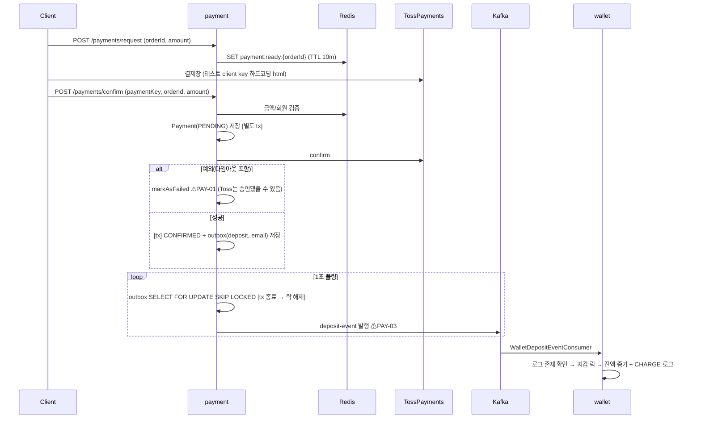
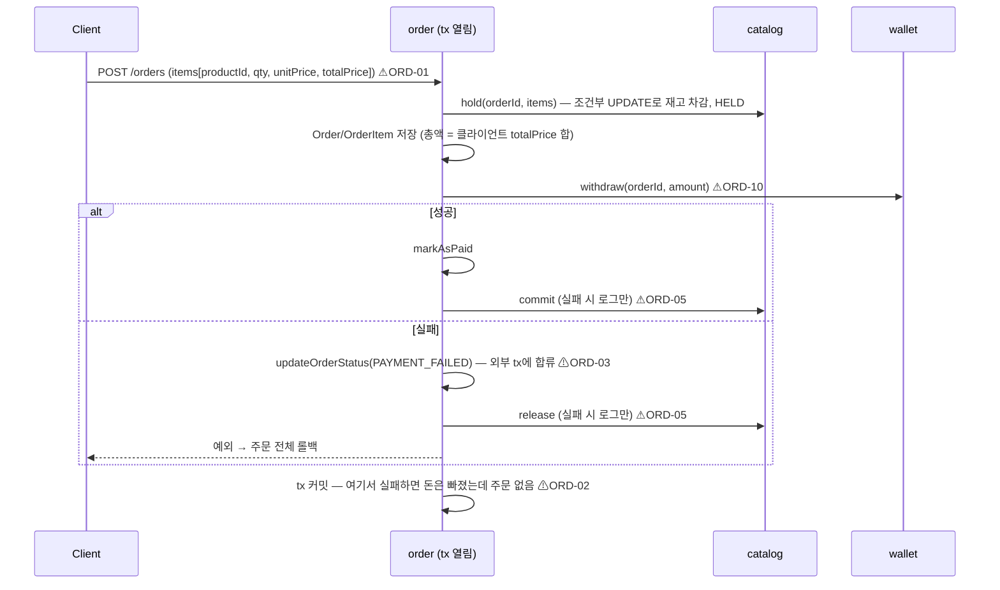
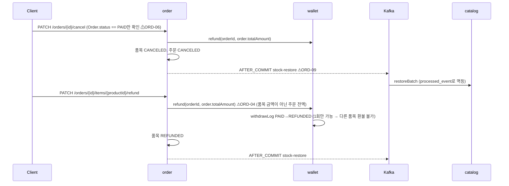
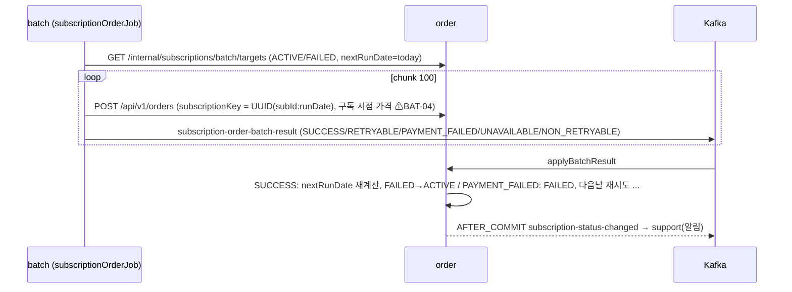
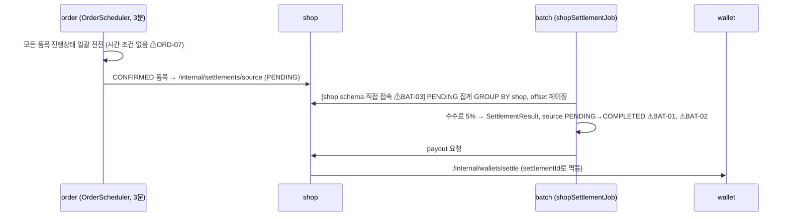
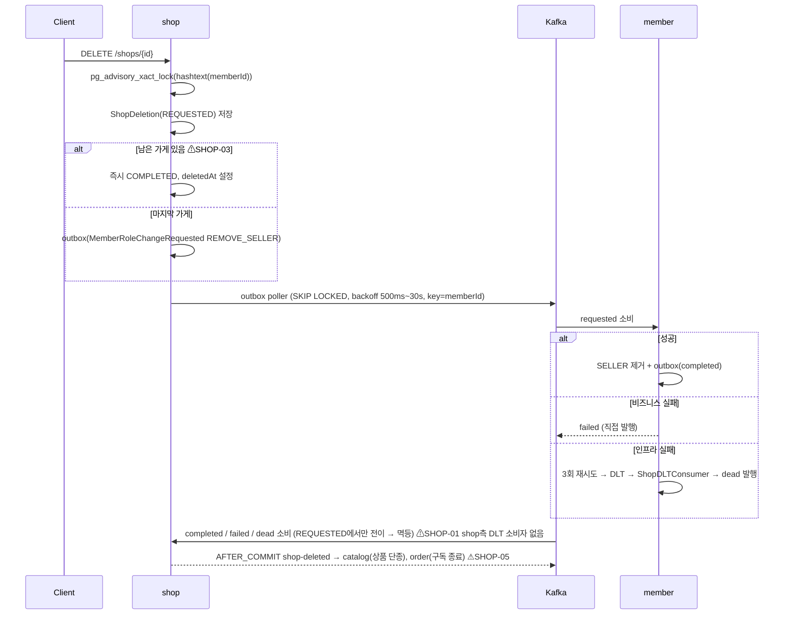

# 03. 핵심 흐름 (As-Is)

> 다이어그램의 `⚠ID`는 [04-issues.md](04-issues.md)의 결함 ID.

## 1. 지갑 충전 (Toss)

## 2. 주문 생성 (예치금 결제)

`order-service/.../order/application/OrderService.java#create` — 메서드 전체가 하나의 `@Transactional`.

## 3. 주문 취소 / 품목 환불

## 4. 구독 갱신 (배치)

## 5. 구매확정 → 정산

## 6. 가게 삭제 Saga (본인 구현)

`shop-service/.../shop/application/ShopService.java#deleteMyShop`, 설계: [shop_delete_saga_design.md](../references/original-saga/shop_delete_saga_design.md)

가게 등록 Saga도 동일 구조(ADD_SELLER, ShopRegistration).

## 7. 회원 탈퇴
`MemberService.deleteMember`: 트랜잭션 안에서 wallet/order/shop Feign 3회 검증 + Redis 삭제 ⚠MEM-07 → `member-deleted` 발행 → shop은 `deleteAllMyShop`(Saga·락 우회 ⚠SHOP-04), catalog/order/wallet 각자 정리.
