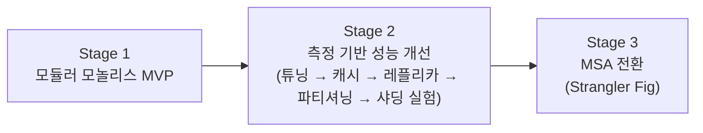

# 01. 아키텍처 진화 로드맵

> 원칙: **측정 → 병목 확인 → 개선 → 재측정**. 다음 단계로 넘어갈 근거는 항상 수치로 남긴다.
> 이 문서가 이력서·면접의 뼈대가 된다. 각 단계의 "산출물"이 곧 이력서 bullet 후보다.

## Stage 1. 모듈러 모놀리스 MVP
**목표**: 요구사항 M 항목을 정합성 불변식(INV)과 테스트까지 갖춰 완성한다. 모듈 경계는 처음부터 MSA 전환이 가능한 수준으로 지킨다.

| 항목 | 내용 |
|---|---|
| 구조 | 단일 Spring Boot 앱, 모듈 11개 ([02-architecture-stage1.md](02-architecture-stage1.md)) |
| 경계 강제 | Spring Modulith `verify()` 테스트. 모듈 간에는 `api` 패키지만 참조, schema 간 조인 금지 |
| 트랜잭션 | 한 요청 안의 모듈 간 쓰기는 하나의 로컬 트랜잭션 허용(예: 주문 생성 + 재고 예약). 단, 모듈 API는 비즈니스 키(orderId 등)로 멱등하게 설계해 원격 호출로 전환할 수 있게 한다 |
| 비동기 | 후속 처리(알림, 검색 색인, 정산 적재, 역할 변경)는 Outbox → Kafka → 같은 앱 안의 consumer |
| 외부 분산 문제 | PG(Toss) 승인·취소의 불확실성, 대사(reconciliation). 모놀리스에서도 그대로 존재하는 진짜 분산 문제 |
| 관측성 | 처음부터 ELK(JSON 로그 + traceId 검색), Prometheus/Grafana(메트릭·알림) |

**완료 기준**: CI 전체 테스트 통과, Saga·동시성 테스트 통과, 로컬에서 `docker compose up` 한 번으로 전체 기동.

**이력서 산출물**
- 팀 MSA 프로젝트의 결함 54건 분석 → 모듈러 모놀리스로 재설계한 근거(ADR)
- PG 결제의 결과 불확실성 처리: 결과미확정 상태 + 대사 잡 → INV-02 보장
- 정합성 불변식 11개를 자동화 테스트로 검증

## Stage 2. 측정 기반 성능 개선
**진입 조건**: Stage 1 완료 + 대용량 시드 데이터 + k6 Baseline 측정.

시드 데이터 규모 [제안]: 회원 100만, 가게 1만, 상품 100만, 주문 1,000만(주문품목 약 2,500만), 재고 이력 3,000만.

| 단계 | 진입 근거(측정) | 작업 | 측정 지표 |
|---|---|---|---|
| 2-1 Baseline | - | k6 시나리오(NFR-PERF-01~06), `pg_stat_statements`, slow query log, Grafana 대시보드 | p50/p95/p99, TPS, 에러율, DB CPU, 커넥션 대기 |
| 2-2 쿼리 튜닝 | 상위 slow query | `EXPLAIN ANALYZE`, 복합·커버링 인덱스, N+1 제거(fetch join / batch size), offset → keyset 페이징, 집계 쿼리 개선 | 쿼리별 실행시간 전후 비교 |
| 2-3 커넥션·스레드 | 커넥션 대기, 스레드 포화 | HikariCP 크기 산정, 플랫폼 스레드 vs 가상 스레드(Java 25, pinning 해소) 비교, 트랜잭션 범위 축소, Compact Object Headers 메모리 비교 | 커넥션 대기시간, TPS |
| 2-4 캐시 | 읽기 비중이 높은 API의 DB 부하 | 상품 상세·목록 Redis 캐시, 캐시 스탬피드 방지, 무효화 전략(이벤트 기반) | 캐시 히트율, DB QPS |
| 2-5 핫스팟 경합 | 인기상품 동시 주문 시 락 대기 | 비관적 락 / 조건부 UPDATE / Redis 원자 차감 + 비동기 확정 비교 실험 | 경합 시나리오 TPS, 초과판매 0 유지 |
| 2-6 Read Replica | 읽기 쿼리가 primary CPU를 잠식 | Postgres 스트리밍 복제, `@Transactional(readOnly)` 기반 라우팅, 복제 지연 대응(주문 직후 조회는 primary = read-your-writes) | primary CPU, 읽기 p95, 복제 지연 |
| 2-7 파티셔닝 | 대형 테이블(주문·재고 이력) 인덱스 비대, 기간 조회 느림 | 월 단위 선언적 파티셔닝, 오래된 파티션 아카이빙 | 기간 조회 p95, 인덱스 크기, VACUUM 시간 |
| 2-8 샤딩 **(실험)** | 단일 primary 쓰기 TPS 한계를 측정으로 확인한 경우에만 | 주문 데이터 memberId 기준 샤딩 실험(애플리케이션 라우팅 또는 Citus 비교), 리샤딩·교차 샤드 조회 문제 정리 | 쓰기 TPS 상한, 교차 샤드 쿼리 비용 |

**정직성 원칙**: 2-8은 "이 규모에서 필요해서"가 아니라 "한계를 측정하고 대안을 검증한 실험"으로 기록한다. 면접에서 "왜 샤딩했나"보다 "언제 샤딩이 필요하고 비용이 무엇인지 측정해봤다"가 강하다.

**이력서 산출물**: 단계별 전후 수치(예: "주문 목록 p95 1.2s → 80ms, 커버링 인덱스 + keyset 페이징"), 핫스팟 재고 차감 방식 비교 실험, 레플리카 도입과 복제 지연 대응.

## Stage 3. MSA 전환 (Strangler Fig)
**진입 근거** (성능이 아니라 아래 사유를 측정·사례로 제시)
1. **확장 특성 차이**: 검색·조회는 읽기, 주문·결제는 쓰기, AI는 배치·외부 API 의존. 함께 스케일하면 비효율
2. **장애 격리**: LLM·ES 지연이 주문 스레드·커넥션을 잠식하는 장애 주입 실험 결과
3. **배포 독립성**: 결제 모듈 변경이 전체 배포를 요구하는 문제

**분리 순서** (위험이 낮고 효과가 확실한 것부터)

| 순서 | 대상 | 이유 | 전환 시 새로 생기는 문제 |
|---|---|---|---|
| 1 | notification, search, recommendation | 이미 이벤트로만 연결된 읽기 측 → consumer를 옮기면 끝 | 거의 없음 (Stage 1 설계의 검증) |
| 2 | payment | 외부 PG 격리, 보안 경계, 독립 배포 | 주문↔결제 원격 호출, 결제 결과 콜백 |
| 3 | product(inventory) / order / payment | 쓰기 확장, 장애 격리 | **체크아웃 로컬 트랜잭션 → 오케스트레이션 Saga**, 예약 TTL·보상·멱등이 필수가 됨 |
| 4 | member+shop | 인증 분리, 게이트웨이 도입 | 역할 변경 Saga(원 프로젝트 경험), 게이트웨이 인가 |

**인프라**: API Gateway, k8s Service 기반 디스커버리(Eureka 미사용), 서비스별 DB(Stage 1의 schema 분리 → 물리 분리), 계약 테스트, traceId 로그 추적 유지 + 서비스 간 호출이 생기므로 분산 트레이싱(OTel/Tempo) 도입 재검토.

**측정**: 전환 전후 지연 증가분, 장애 주입 시 영향 범위, 배포 단위. "MSA로 바꿨더니 빨라졌다"가 아니라 "지연은 X ms 늘었지만 장애 격리·독립 확장을 얻었다"로 기록한다.

**이력서 산출물**: 로컬 트랜잭션 → Saga 전환 과정과 새로 생긴 정합성 문제 해결, Strangler 방식의 무중단 전환, 원 팀 프로젝트(MSA)와의 비교.

## 단계별 문서 산출물
| 단계 | 문서 |
|---|---|
| Stage 1 | 이 폴더(02-design), ADR, 테스트 시나리오 |
| Stage 2 | `docs/perf/` 측정 리포트(환경·스크립트·전후 수치), 튜닝 기록 |
| Stage 3 | 전환 설계서, Saga 설계, 장애 주입 리포트 |
