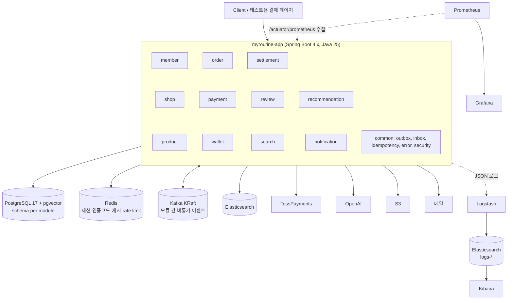
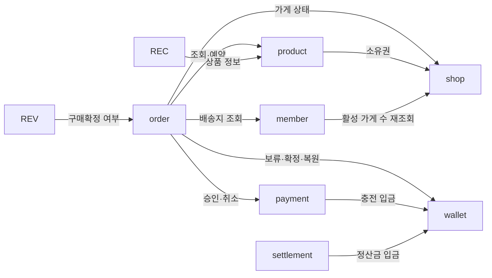

# 02. Stage 1 아키텍처 — 모듈러 모놀리스

## 1. 시스템 구성



As-Is 대비 제거: Eureka, Config Server, API Gateway(Stage 3에서 도입), RabbitMQ(Kafka로 통합, ADR-003).

## 2. 모듈

| 모듈 | 책임 | 소유 데이터 (schema) |
|---|---|---|
| member | 가입·로그인(OAuth), 이메일 인증, 토큰·세션, 회원 정보, 제재, 문의 | `member` |
| shop | 가게 개설·수정·폐업, 판매자 소유권 확인 | `shop` |
| product | 상품, 이미지, 가격 이력, 재고, 재고 예약 | `product` |
| order | 장바구니, 체크아웃, 주문·가게주문·품목, 취소·반품·환불 오케스트레이션, 구독·회차 | `orders` |
| payment | PG 승인·취소·조회, 빌링키, 대사, 예치금 충전 결제 | `payment` |
| wallet | 예치금 잔액·보류·원장, 출금(계좌 송금) | `wallet` |
| settlement | 정산 대상 적재, 월 정산, 판매자 지급 | `settlement` |
| review | 리뷰, 평점 통계, 좋아요, 월간 LLM 요약 | `review` |
| search | ES 상품 색인(프로젝션), 검색·자동완성 | (ES) |
| recommendation | 상품 임베딩, 취향 추천 | `recommendation` |
| notification | 알림 생성·발송·재시도·실패 보관 | `notification` |
| common | Outbox/Inbox, 멱등키, 에러 응답, 보안, 공통 값 객체(Money 등) | `common` |

> order schema 이름은 SQL 예약어 `order`를 피해 `orders`로 한다.

## 3. 모듈 의존 규칙


실선은 **동기 호출(모듈 API)**. 그 외 연결은 모두 Kafka 이벤트([05-events.md](05-events.md)).

규칙
1. 다른 모듈은 `{module}.api` 패키지(인터페이스 + DTO)만 참조한다. `domain`, `infrastructure`는 외부 비공개.
2. 동기 의존은 위 그래프의 방향만 허용한다(순환 금지). 역방향 통지는 이벤트로 한다.
3. 다른 모듈의 테이블을 조회하거나 조인하지 않는다(schema 단위 소유).
4. 모듈 API의 쓰기 메서드는 비즈니스 키(orderId, refundId 등)를 받아 **멱등**하게 만든다 → Stage 3에서 원격 호출로 바꿔도 의미가 그대로 유지된다.
5. 같은 요청 안의 동기 쓰기는 하나의 로컬 트랜잭션으로 묶을 수 있다. **외부 시스템(PG, 메일, OpenAI, S3) 호출은 트랜잭션 밖에서 한다** (NFR-REL-06).
6. 1~3번은 Spring Modulith `ApplicationModules.of(App.class).verify()` 테스트로 CI에서 강제한다.

## 4. 패키지 구조
```
com.myroutine
├── member
│   ├── api            # MemberApi(interface), 공개 DTO, 공개 이벤트
│   ├── application    # 유스케이스(트랜잭션 경계)
│   ├── domain         # 엔티티, 값 객체, 도메인 규칙, 리포지토리 인터페이스
│   ├── infrastructure # JPA, Redis, 외부 클라이언트, Kafka consumer
│   └── web            # REST 컨트롤러, 요청/응답 DTO
├── shop ...
└── common
    ├── outbox / inbox / idempotency
    ├── error          # ErrorCode, BusinessException, GlobalExceptionHandler
    ├── security       # JWT, 인증 필터, @CurrentMember
    └── model          # Money, 공통 ID 생성기
```

## 5. 횡단 설계

### 5.1 인증·인가 (ADR-006)
- Access JWT(15분, 클레임: memberId, roles, tokenVersion), Refresh는 Redis 세션(기기별, 교체·재사용 탐지).
- 판매자 기능은 **역할이 아니라 소유권으로 인가**한다(`shop.memberId == 요청자`). SELLER 역할은 UI 노출용이라, 역할 반영이 늦어도 기능은 막히지 않는다.
- 제재·탈퇴·로그아웃 전체 시 `tokenVersion`을 증가시킨다. 필터가 Redis에 캐시한 현재 버전과 비교해 즉시 무효화한다.

### 5.2 비동기 이벤트 (ADR-003)
- 상태 변경과 같은 트랜잭션에서 `common.outbox_event`에 저장한다. 릴레이가 선점(lease) 후 Kafka로 발행한다.
- consumer는 `common.processed_message`(consumer + eventId)로 멱등 처리하고, 재시도 후 DLT로 보낸다. DLT 조회·재처리용 관리 API를 둔다.

### 5.3 멱등 API
- 생성·결제 계열 POST는 `Idempotency-Key` 헤더를 받는다. `common.idempotency_key`(key, memberId, requestHash, status, response)에 결과를 저장하고 재요청에는 같은 응답을 돌려준다.
- 대상: 상품 등록, 체크아웃, 결제 승인, 충전, 출금, 취소·반품 요청.

### 5.4 스케줄 작업
다중 인스턴스 중복 실행은 **Postgres 세션 레벨 advisory lock**으로 막는다(별도 라이브러리 없음). Stage 2에서 인스턴스를 여러 개 띄울 것을 전제한다.
- 작업 시작 시 전용 커넥션에서 `pg_try_advisory_lock(hashtext('job:{이름}'))` → false면 건너뛴다 → 작업이 끝나면 같은 커넥션에서 `pg_advisory_unlock`.
- 트랜잭션 레벨 락(`pg_advisory_xact_lock`)은 첫 커밋에서 풀리므로, 건별로 커밋하는 스케줄 작업에는 쓰지 않는다.
- 앱이 죽으면 커넥션이 끊기면서 락도 풀린다(락 만료 시간 관리가 필요 없음). 대신 작업 시간 동안 커넥션 1개를 점유한다.
- 락은 동시 실행만 막는다. 작업 자체의 멱등성은 별도로 보장한다(정산 UK, 상태 CAS 등).

| 작업 | 주기 | 모듈 |
|---|---|---|
| 재고 예약·주문 만료 | 1분 | order (product·wallet API 호출) |
| 결제 대사 | 1분 (결과미확정 결제 대상) | order(주문 결제: PaymentApi.reconcile 호출), payment(충전: wallet 직접 반영) |
| 자동 구매확정 | 1시간 | order |
| 구독 회차 실행 | 매일 06:00 | order |
| 정산 | 매월 5일 03:00 | settlement |
| 리뷰 요약 | 매월 1일 04:00 | review |
| Outbox 릴레이 | 상시 (폴링 + 백오프) | common |
| 정체 Saga·Outbox 탐지 | 5분 | common (메트릭·알림) |

> 배치는 Spring Batch 대신 **스케줄러 + 청크 단위 트랜잭션 + keyset 페이징**으로 시작한다. 정산이 Stage 2 성능 목표(100만 건 10분)를 못 맞추면 Spring Batch 파티셔닝을 도입한다.

### 5.5 금액
모든 금액은 원 단위 `BIGINT`(Java `long`, `Money` 값 객체)로 다룬다. As-Is의 `numeric(38,2)` → `long` 반올림 변환을 없앤다.

### 5.6 ID
애플리케이션에서 생성하는 UUIDv7(시간 순서)을 사용한다. 인덱스 지역성이 좋고, 샤딩·서비스 분리 시 충돌이 없다.

### 5.7 에러 응답
```json
{ "code": "ORDER_RESERVATION_EXPIRED", "message": "주문 유효시간이 지났습니다.", "traceId": "4bf92f35...", "details": {} }
```

## 6. 인프라 (docker-compose)
| 구성 | 용도 |
|---|---|
| postgres (pgvector/pg17) | 앱 DB. Stage 2에서 replica 추가 |
| redis | 세션, 인증코드, rate limit, 캐시, tokenVersion |
| kafka (KRaft, 단일 브로커) | 이벤트 |
| elasticsearch | 검색(`products`) + 로그(`logs-*`) 인덱스 |
| logstash, kibana | 로그 수집·조회 (ELK) — compose 프로필 `observability` |
| prometheus, grafana | 메트릭·대시보드·알림 — compose 프로필 `observability` |
| pg-fake | 부하 테스트용 Toss Fake. 테스트용 가짜 PG 서버(`FakePgServer`)에 main을 붙여 컨테이너로 띄움. 지연·실패 비율을 환경변수로 설정 |

## 7. 테스트 전략
| 계층 | 도구 | 대상 |
|---|---|---|
| 단위 | JUnit5, AssertJ | 상태머신, 금액 계산, 정책(POL), 불변식 |
| 모듈 경계 | Spring Modulith | 의존 규칙 위반 |
| 통합 | Testcontainers(Postgres, Redis, Kafka), 테스트용 가짜 PG 서버(JDK 내장 HttpServer) | 리포지토리 쿼리, Outbox/Inbox, 체크아웃·환불 흐름 |
| 시나리오 | 위와 동일 | Saga 정상·보상·중복·타임아웃·순서 역전 (NFR-TST-04) |
| 동시성 | ExecutorService + CountDownLatch | 초과판매, 이중 차감, 중복 결제 0건 |
| 부하 | k6 | NFR-PERF |
