# 03. ERD (Stage 1)

공통 규칙
- PK: UUIDv7 `uuid`. 금액: `bigint`(원). 시각: `timestamptz`.
- 모든 테이블에 `created_at`, 변경 가능한 테이블에 `updated_at` (다이어그램에서는 생략).
- **FK는 같은 schema 안에서만** 건다. 다른 모듈 참조는 ID 값만 저장한다(Stage 3 분리 대비).
- 다이어그램의 `UK`는 unique 제약. 멱등성·불변식의 마지막 방어선이다.
- 동시성 제어 방식은 엔티티별로 표기했다: `version`(낙관적 락), 조건부 UPDATE, `FOR UPDATE`.

---

## member
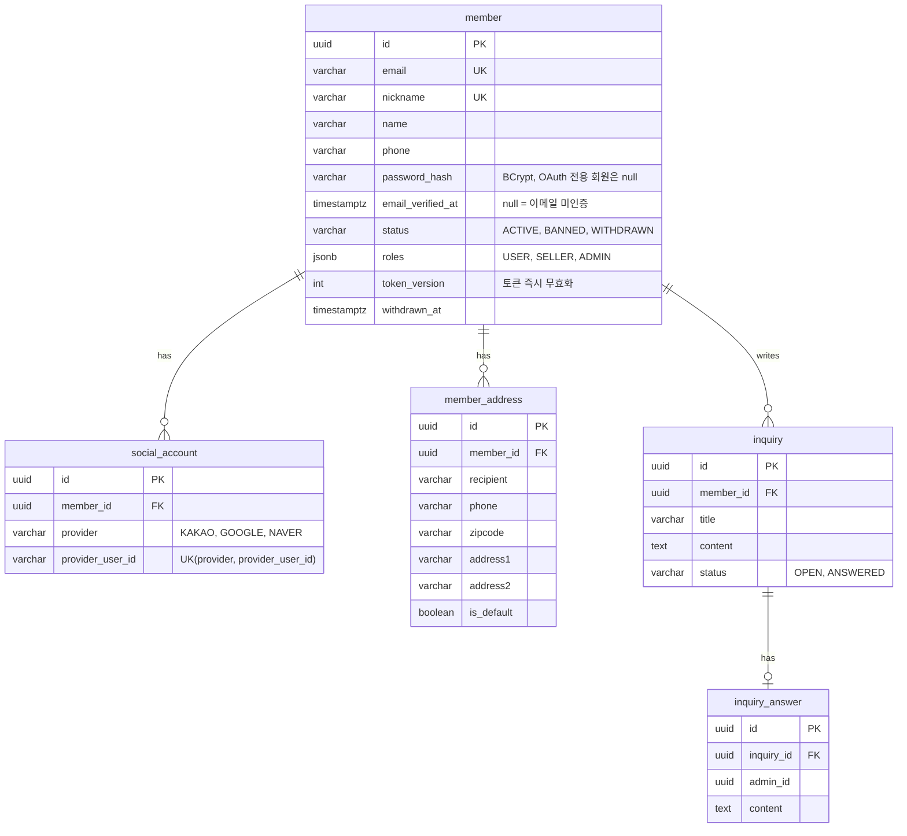
Redis: `auth:email-code:{email}`(코드, 시도 횟수, TTL 5분), `auth:email-rate:{email}`, `auth:session:{sessionId}`(memberId, familyId, refreshHash, 기기), `auth:token-version:{memberId}`, `auth:login-fail:{email}`(연속 실패 횟수, TTL 15분).
- 한 회원은 비밀번호(`password_hash`)와 소셜 계정(`social_account`)을 함께 가질 수 있다. 둘 다 없는 회원은 없다.
- 이메일 미인증 회원은 주문·결제·가게 개설 API를 쓸 수 없다(FR-MEM-09).
- Redis는 로드맵 Part 4에서 도입한다. 그 전에는 로그인 실패 제한·refresh 세션 없이 Access 토큰만 쓴다.

## shop
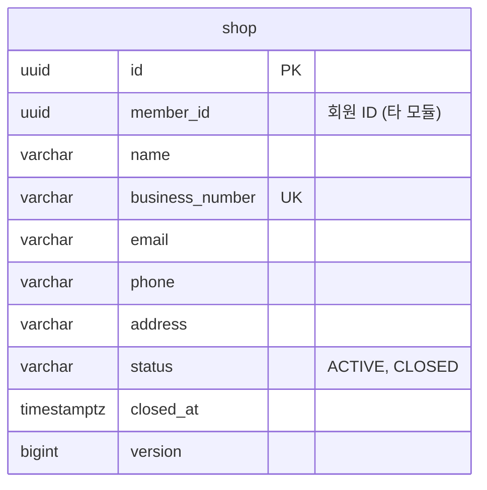
- 개설 즉시 ACTIVE + `shop.shop-opened` 이벤트 → member가 SELLER 부여(최종적 일관성, 소유권 기반 인가라 지연돼도 무방).
- 폐업은 같은 회원의 개설·폐업을 `pg_advisory_xact_lock(memberId)`로 직렬화한다(원 프로젝트 방식 계승).

## product
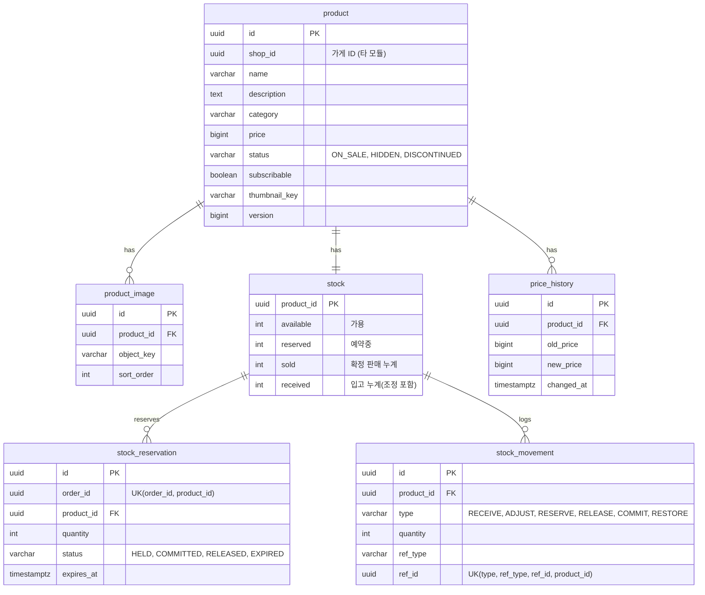
- 예약: `UPDATE stock SET available = available - :q, reserved = reserved + :q WHERE product_id = :id AND available >= :q` (원자적 조건부 UPDATE, As-Is 방식 계승). 반영된 행 수가 0이면 재고 부족.
- 수량 전이: 예약 `available→reserved`, 확정 `reserved→sold`, 해제·만료 `reserved→available`, 환불 복구 `sold→available`, 입고·조정 `received, available` 동시 증감.
- INV-03: 항상 `available + reserved + sold = received`, 각 값 ≥ 0. 정합성 점검 잡이 `stock`과 `stock_movement` 합계를 비교한다.
- `stock_movement`의 unique 제약이 예약·복구의 멱등을 보장한다(같은 주문의 같은 상품 복구는 1회).

## order (schema: orders)
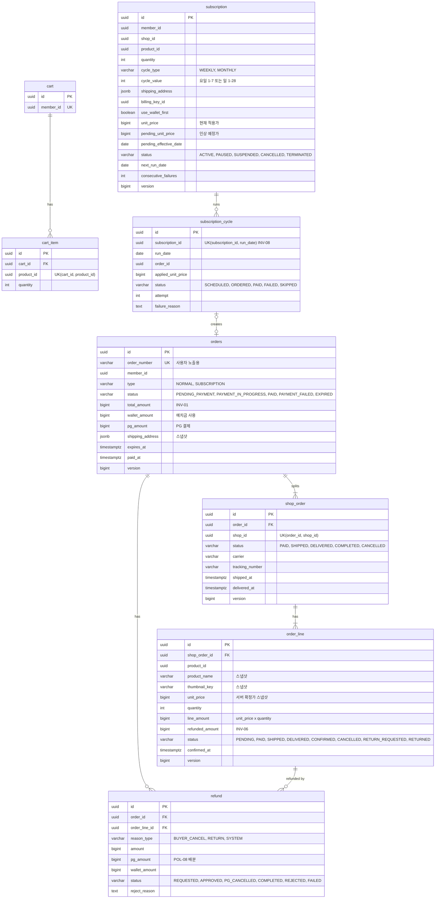
- 주문 만료 스윕: `WHERE status = 'PENDING_PAYMENT' AND expires_at < now()` → 인덱스 `(status, expires_at)`.
- 가게주문 조회: 인덱스 `shop_order(shop_id, status, created_at)` (must #1·2).
- 자동 구매확정: 인덱스 `shop_order(status, delivered_at)`.
- 매월 일자는 1~28로 제한해 월말 문제를 피한다 [제안].

## payment
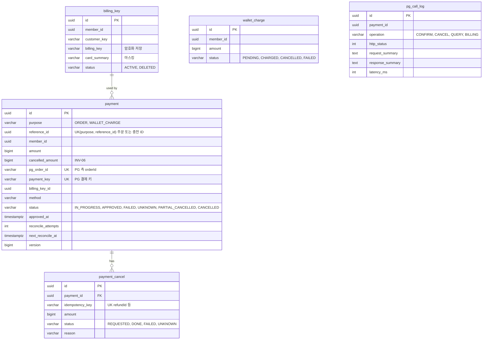
- `(purpose, reference_id)` unique: 주문 1건당 결제 1건 (FR-ORD-06, INV-02).
- `pg_call_log`: PG 호출 감사 로그. 대사·장애 분석용.
- 대사 대상 인덱스: `(status, next_reconcile_at)`.

## wallet
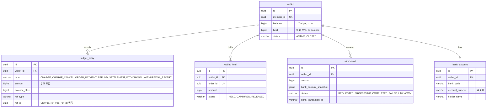
- 잔액 변경은 `SELECT ... FOR UPDATE`로 지갑 행을 잠근 뒤, 원장 기록과 잔액 갱신을 같은 트랜잭션에서 한다(As-Is 방식 유지 + 원장 일원화).
- 가용잔액 = `balance - held`. 보류는 `held += amount`, 확정(capture)은 `balance -= amount, held -= amount` + 원장 `ORDER_PAYMENT`, 해제는 `held -= amount`.
- 원장 unique 제약 → 같은 환불·정산·충전이 두 번 반영되지 않는다 (WAL-01 대응: 중복 요청은 기존 결과 반환).
- 정합성 점검 잡: `wallet.balance = Σ ledger_entry.amount` (INV-05).

## settlement
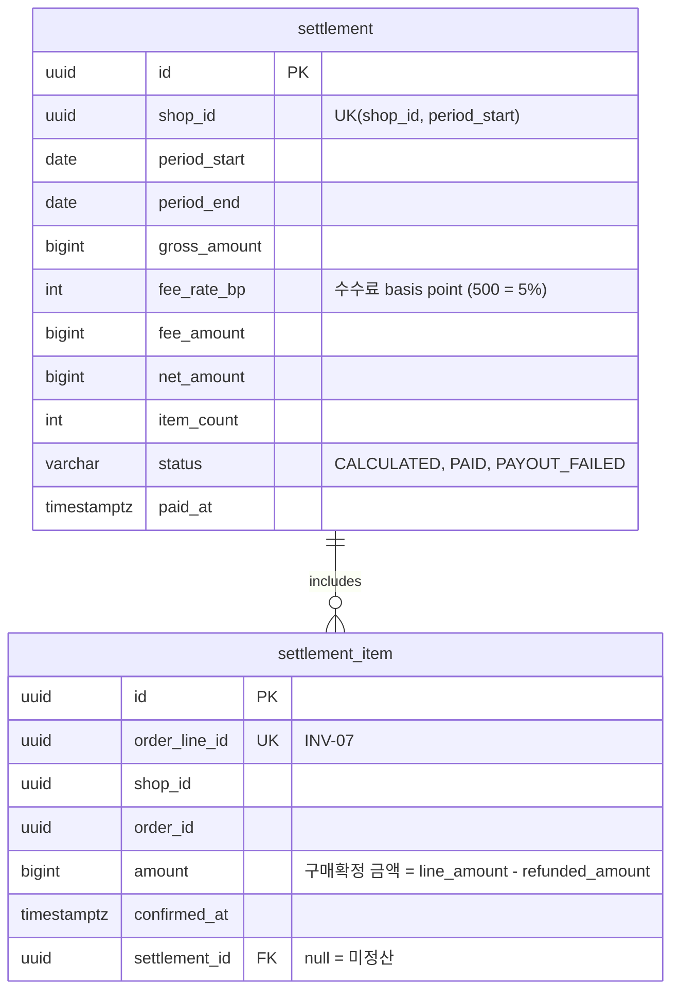
- `order.order-line-confirmed` 이벤트 소비 → `settlement_item` 적재 (`order_line_id` unique로 멱등).
- 정산 실행: 가게 ID keyset 순회 → 가게별 한 트랜잭션에서 `settlement` 생성 + 해당 기간 미정산 item에 `settlement_id` 설정 (BAT-02 offset 누락 문제 제거).
- 지급: wallet API `deposit(type=SETTLEMENT, refId=settlementId)` — 원장 unique로 멱등.
- 인덱스: `settlement_item(shop_id, confirmed_at) WHERE settlement_id IS NULL` (부분 인덱스).

## review
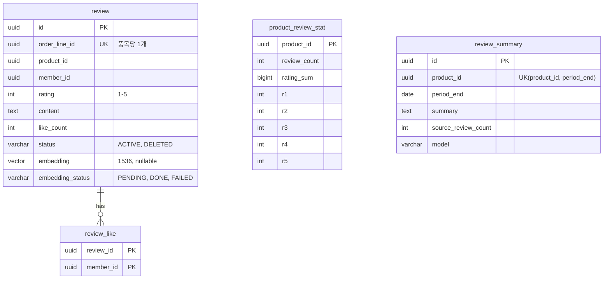
- 통계는 리뷰 작성 트랜잭션에서 조건부 UPDATE로 증감(`review_count = review_count + 1`).
- 좋아요: `review_like` PK로 중복 방지 + `like_count` 원자적 증감.

## recommendation
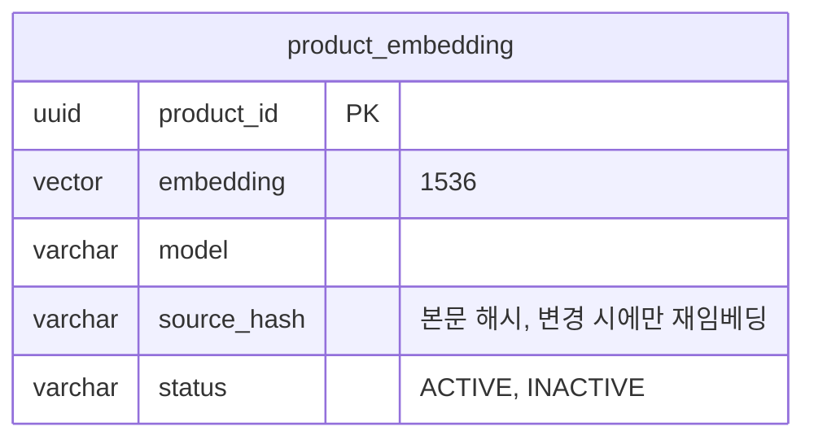
- 취향 벡터 캐시: Redis `rec:taste:{memberId}`(TTL 30분).

## notification
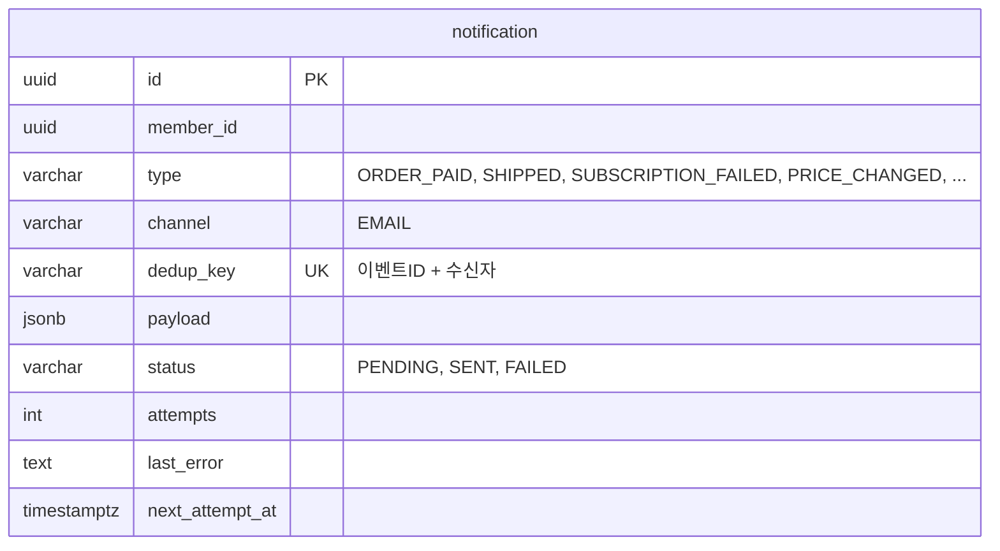

## common
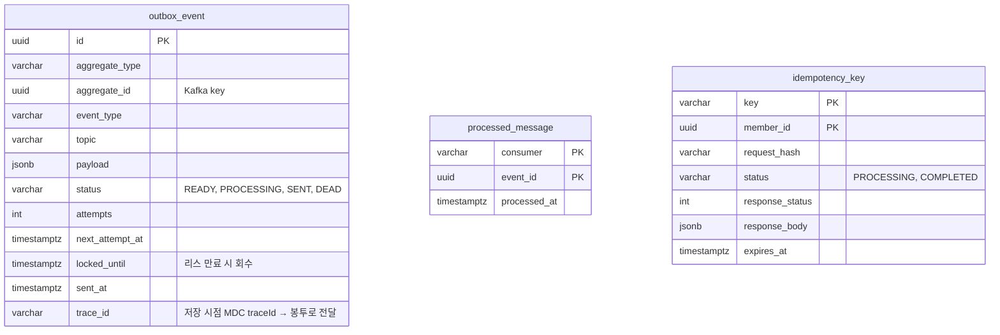
- 같은 키 동시 요청: `idempotency_key` INSERT 충돌 → PROCESSING이면 409, COMPLETED면 저장된 응답 반환. requestHash가 다르면 422.
- Outbox 정리: SENT 7일 경과분 삭제 (Stage 2-7에서 파티셔닝 후보).
