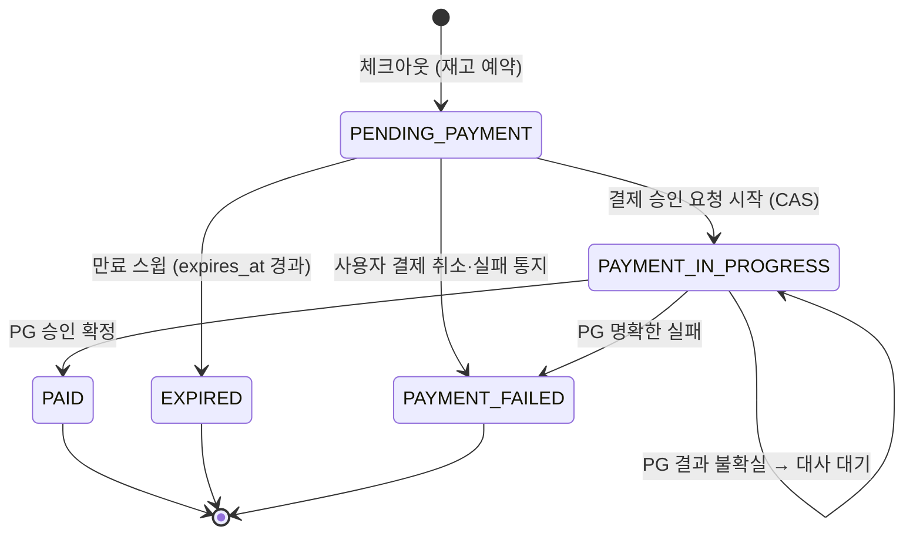
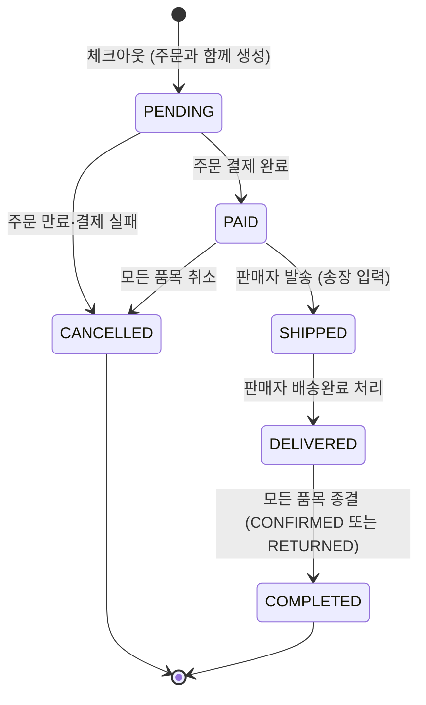
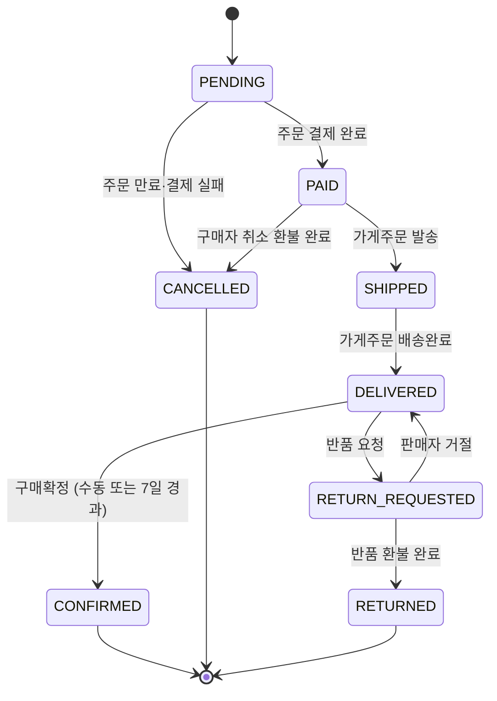
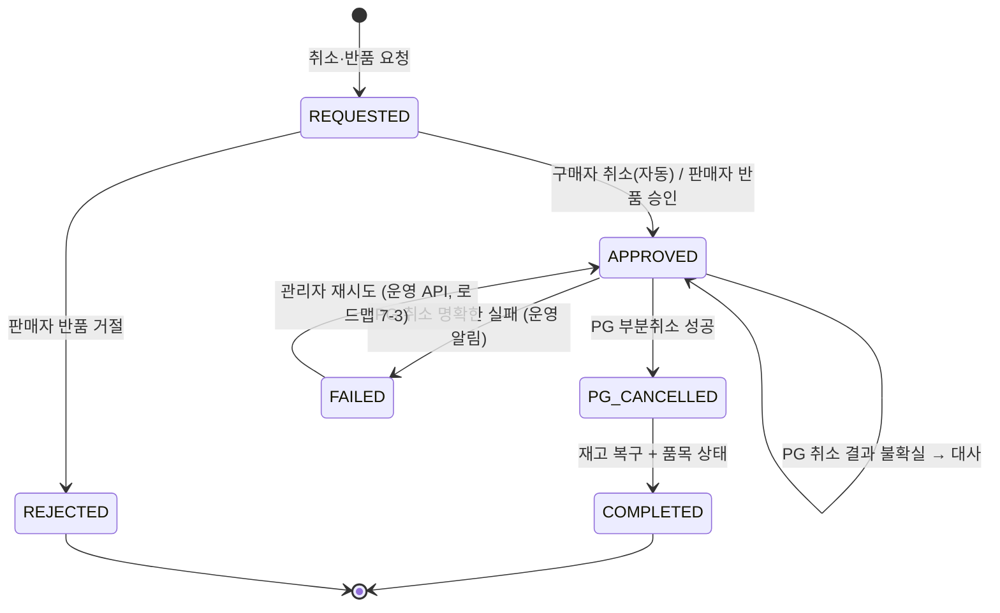
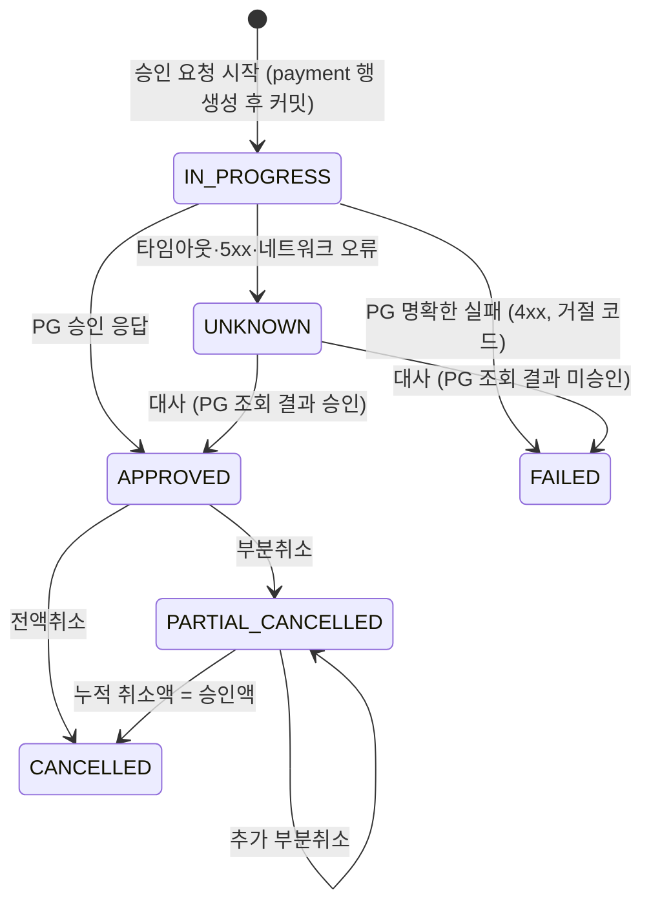
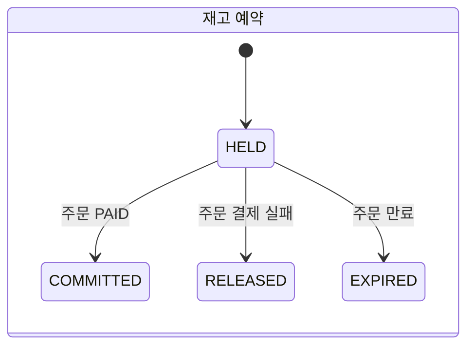
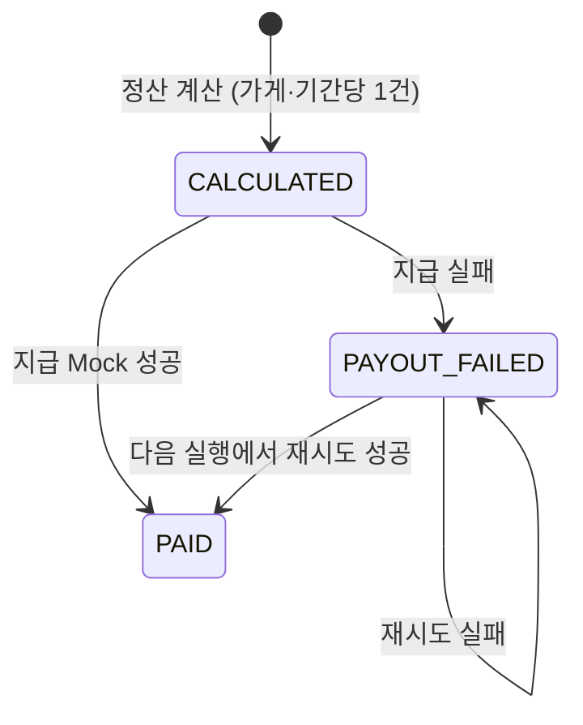
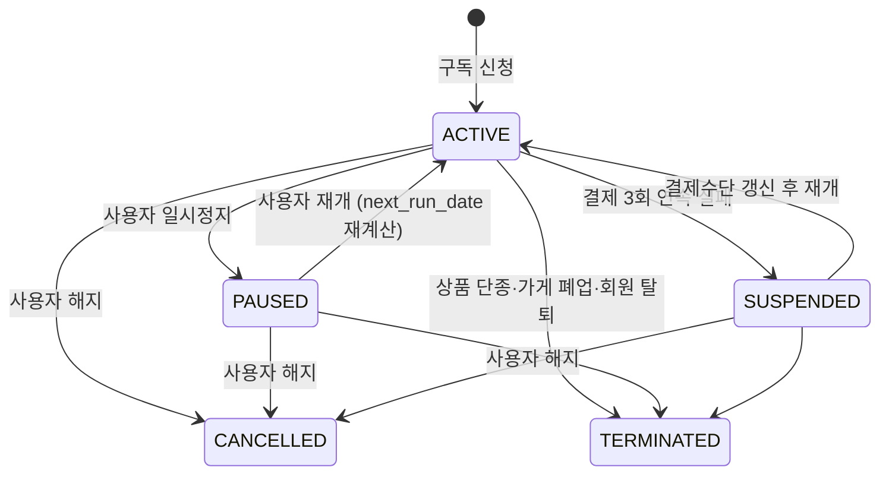
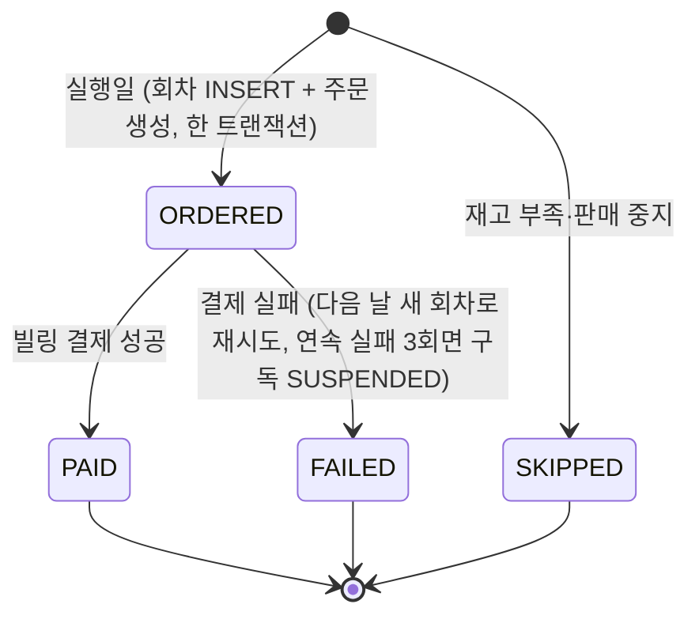

# 04. 상태머신

> 2026-10-02: 예치금 제거 — 주문은 항상 PG 결제를 거친다(즉시 PAID 경로 삭제), 환불은 PG 부분취소만, 예치금 보류·출금 상태머신 삭제.

원칙
- 모든 전이는 **허용된 이전 상태에서만** 일어난다. 구현은 `UPDATE ... SET status = :to WHERE id = :id AND status = :from`(CAS) 또는 `version` 낙관적 락으로 한다.
- 반영된 행 수가 0이면 이미 처리됐거나(멱등 성공) 다른 흐름이 먼저 전이한 것(경합)이다. 둘을 구분해 응답한다.
- 상태 enum은 도메인 객체 안에 전이 규칙을 둔다(`order.markPaid()`가 허용 여부를 판단). 단위 테스트 대상.

---

## 1. 주문 (orders.status) — 결제 단위

| 전이 | 함께 일어나는 일 (같은 로컬 트랜잭션) |
|---|---|
| → PAID | 재고 예약 COMMITTED, 가게주문·품목 PAID, outbox `order-paid` |
| → EXPIRED / PAYMENT_FAILED | 재고 예약 RELEASED·EXPIRED, 가게주문·품목 CANCELLED |

핵심 규칙
- **PG 승인은 우리 서버가 confirm API를 호출할 때만 일어난다.** 만료 스윕은 `PENDING_PAYMENT`만 대상으로 하므로, 승인 요청이 진행 중인 주문(`PAYMENT_IN_PROGRESS`)은 만료되지 않는다 → "만료됐는데 승인됨" 경합을 상태 전이로 차단한다.
- 승인 요청 시작(CAS)이 실패하면 이미 만료·실패한 주문이다 → PG를 호출하지 않고 거절한다. PG 인증 건은 승인하지 않으면 PG 측에서 자동 소멸한다.
- PG 승인은 확정됐는데 로컬 완료 처리가 실패하면(버그·DB 장애) 대사 잡이 `payment.APPROVED && order != PAID`를 찾아 완료를 재시도한다. 재시도로도 완료할 수 없으면 PG 승인을 취소한다(INV-02).
- 재고 예약의 만료는 **주문 모듈이 단독으로 주도**한다(예약의 `expires_at`은 참고값). Stage 3에서 서비스를 나누면 product에도 자체 TTL 안전망이 필요하다.

## 2. 가게주문 (shop_order.status) — 판매자 처리 단위

- 발송 가드: 해당 가게주문에 진행 중인 환불(REQUESTED/APPROVED/PG_CANCELLED)이 있으면 발송할 수 없다. 발송은 CANCELLED가 아닌 품목에만 적용된다.

## 3. 주문품목 (order_line.status) — 취소·반품·정산·리뷰 단위

- **POL-07 구체화**: 발송 전(PAID)에는 즉시 취소, 배송 중(SHIPPED)에는 취소·반품 불가, 배송완료(DELIVERED) 후 구매확정 전에는 반품 요청.
- RETURN_REQUESTED 품목은 자동 구매확정 대상에서 제외한다.
- → CONFIRMED: outbox `order-line-confirmed` (정산 적재, 리뷰 작성 가능).

## 4. 환불 (refund.status) — 품목 단위 오케스트레이션

- 환불액 = 품목 금액 - 이미 환불된 금액. 전액 PG 부분취소다(POL-08). 주문별 누적 취소액 ≤ 승인액(INV-06)은 payment의 CHECK와 주문 행 잠금으로 지킨다.
- PG 부분취소는 `payment_cancel.idempotency_key = refundId`로 호출해 재시도해도 1회만 취소된다.
- COMPLETED 전이 트랜잭션: product `restore(orderId, productId, refId=refundId)`(movement unique로 멱등) + `order_line.refunded_amount` 증가 + 품목 CANCELLED/RETURNED + outbox `order-line-refunded`.

## 5. 결제 (payment.status)

- 대사는 1분 주기 잡이 매번 다시 조회한다(백오프는 선택 사항). `reconcile_attempts`가 임계치를 넘으면 운영 알림(메트릭 `payment_unknown_count`).
- PG 호출 전에 `IN_PROGRESS` 행을 **먼저 커밋**한다 → 호출 도중 앱이 죽어도 대사 대상이 남는다.

## 6. 재고 예약

## 7. 정산 지급 (settlement.status)

- 지급 호출은 트랜잭션 밖에서 하고 멱등 키는 settlementId다. 호출 후 기록 전에 죽어도 같은 키로 다시 부르면 한 번만 지급된다(As-Is WAL-02 교훈).

## 8. 구독 / 구독 회차

- **INV-08 구체화**: 회차(구독 × 날짜) 1개당 주문은 1건. 회차 INSERT(unique)와 주문 생성을 한 트랜잭션에 넣어 같은 날 두 번 실행돼도 주문이 하나다.
- 회차 적용가: `pending_effective_date <= run_date`면 `pending_unit_price`를 적용하고 `unit_price`로 승격한다(POL-03·11).
- 재고 부족은 결제 실패로 세지 않고 SKIPPED 처리 후 알린다 [제안].

## 9. 기타

| 대상 | 상태 | 전이 |
|---|---|---|
| member | ACTIVE, BANNED, WITHDRAWN | ACTIVE⇄BANNED(관리자), ACTIVE→WITHDRAWN(탈퇴, 조건 충족 시). BANNED·WITHDRAWN 전이 시 token_version 증가 |
| shop | ACTIVE, CLOSED | ACTIVE→CLOSED(폐업 조건 충족 시) |
| product | ON_SALE, HIDDEN, DISCONTINUED | ON_SALE⇄HIDDEN, 둘 다 → DISCONTINUED(종결) |
| settlement | CALCULATED, PAID, PAYOUT_FAILED | CALCULATED→PAID / PAYOUT_FAILED→PAID(재시도) |
| outbox_event | READY, PROCESSING, SENT, DEAD | READY→PROCESSING(선점, locked_until)→SENT / 실패 시 READY(백오프) / 최대 시도 초과 DEAD. locked_until 경과한 PROCESSING은 READY로 회수 |
| notification | PENDING, SENT, FAILED | 재시도 백오프, 최대 시도 초과 FAILED(관리 API로 재처리) |
