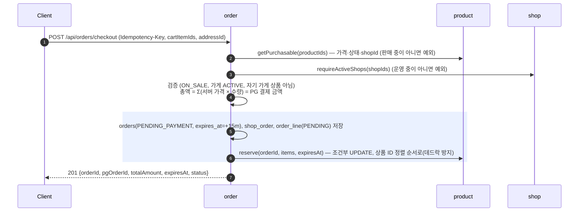
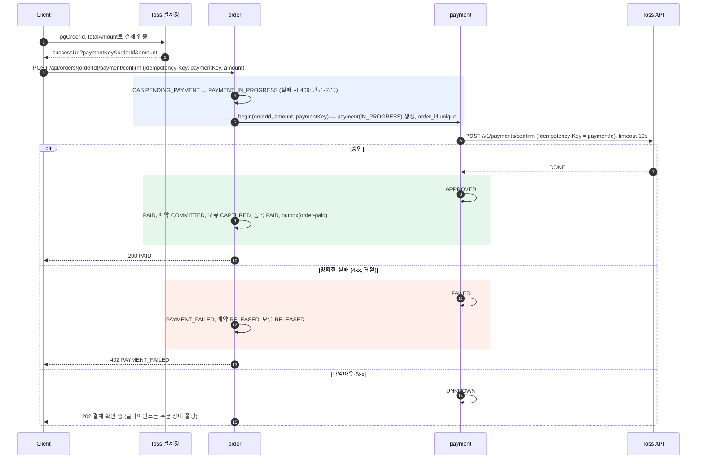
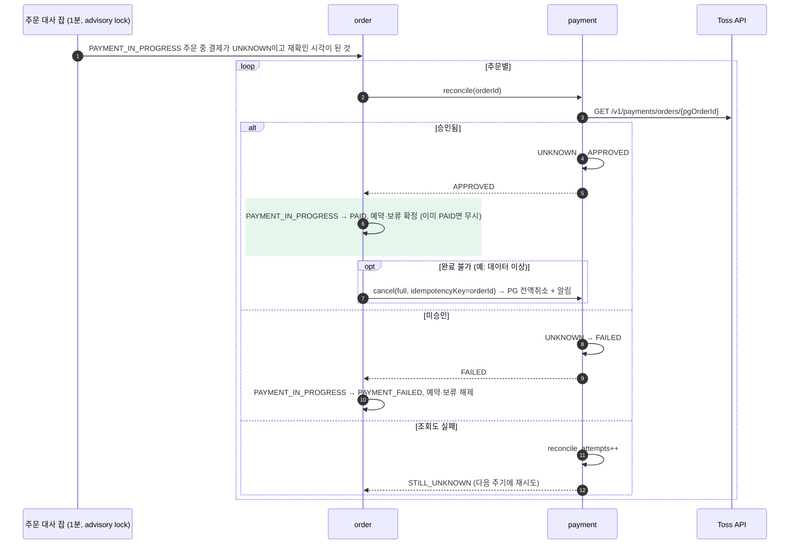
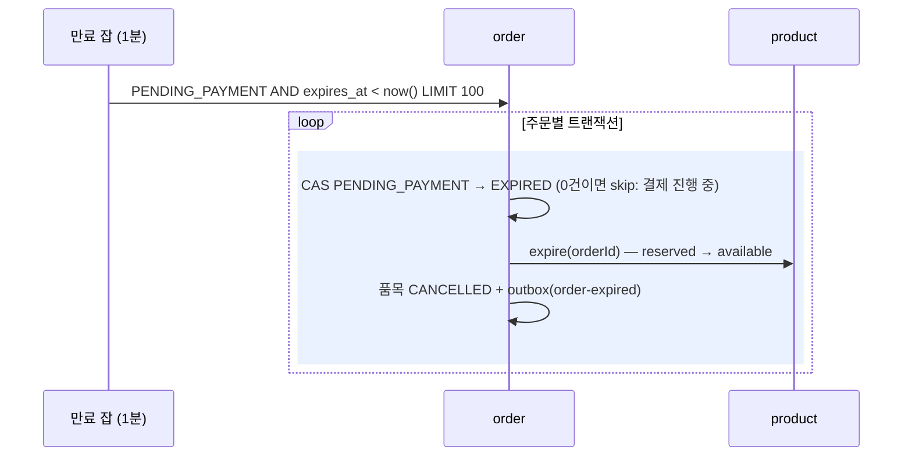
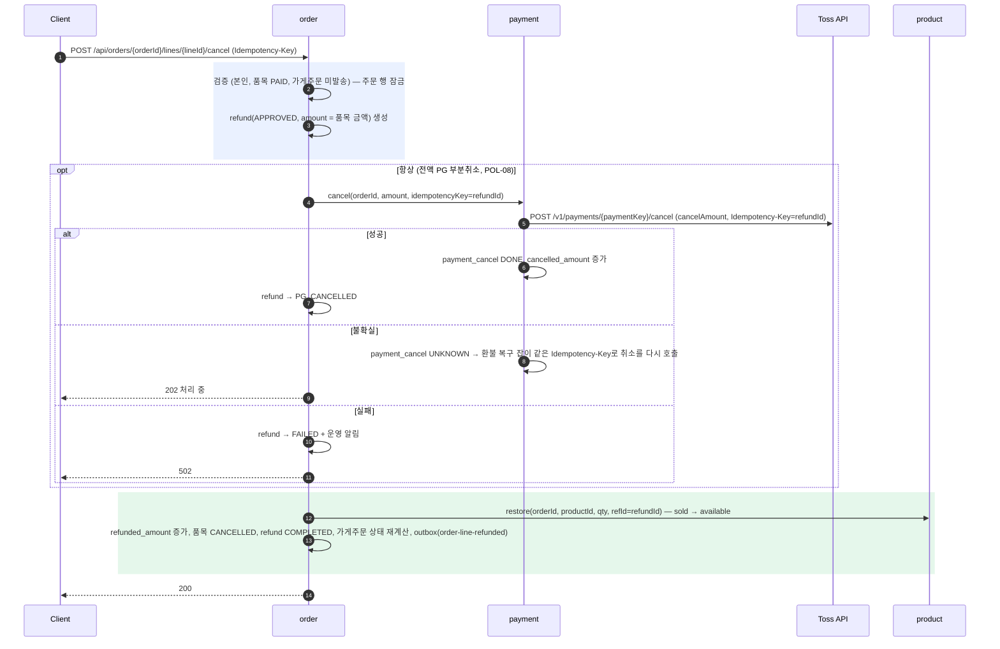
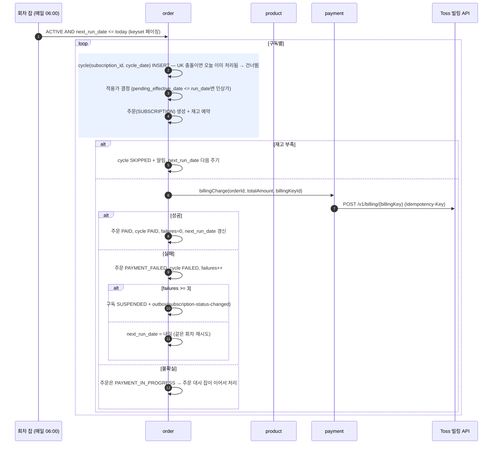
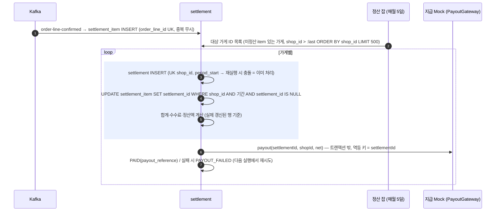
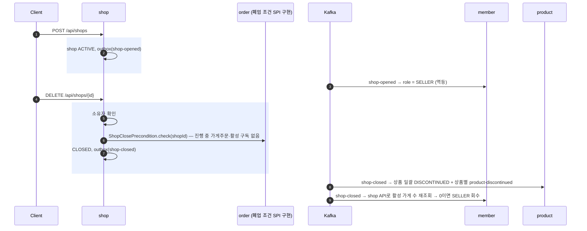
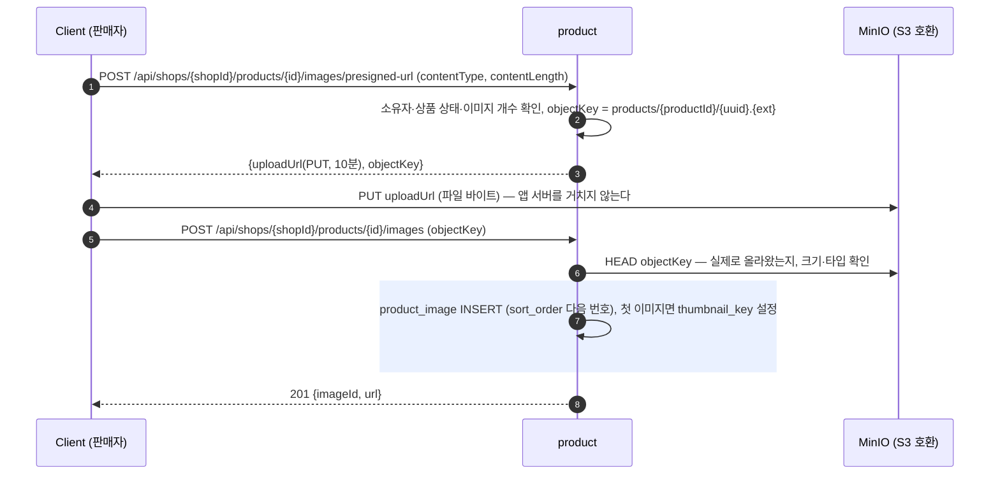
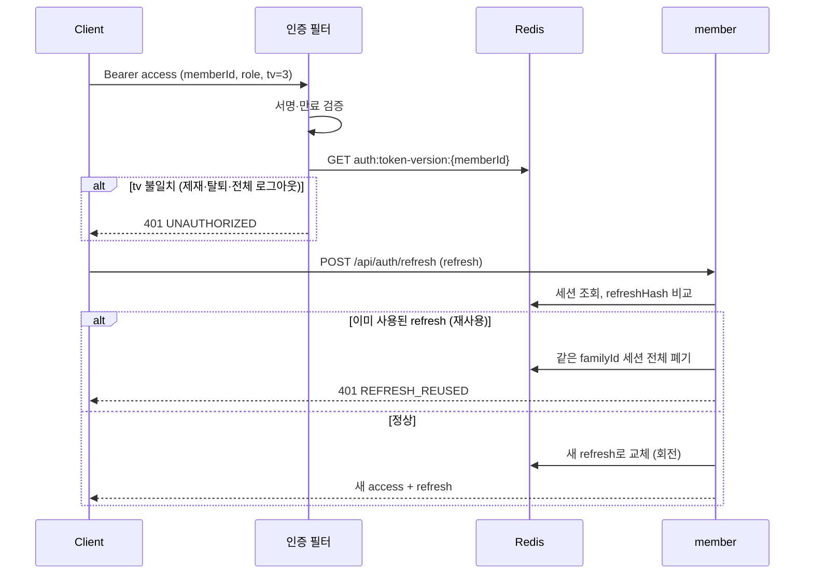

# 06. 핵심 시퀀스

> 2026-10-02: 예치금 제거 반영(체크아웃·만료·환불·구독·정산에서 wallet 삭제, §8 충전 → 상품 이미지 업로드로 교체)

표기: 색 블록 = 하나의 DB 트랜잭션. 외부 호출(PG, 은행, 메일, 객체 저장소)은 항상 트랜잭션 밖이다.

## 1. 체크아웃 (S1)

- 재고 부족이면 트랜잭션 전체(주문 저장 포함)가 롤백된다(모놀리스 로컬 트랜잭션의 이점). Stage 3에서는 이 블록이 Saga로 바뀐다.
- 여러 상품을 예약할 때 **상품 ID 정렬 순서로 UPDATE**해 교차 주문 간 데드락을 막는다.
- 성능 관점: 인기상품 `stock` 행이 핫스팟이 된다 → Stage 2-5 실험 대상.

## 2. 결제 승인 — 정상 / 실패 / 불확실 (S3)

### 대사 (reconciliation) — 주문 모듈이 주도

- 결과를 이벤트로 알리지 않고 **주문이 결제에게 물어본다**(order → payment는 원래 허용된 의존 방향). Kafka 없이 동작하고, 누가 흐름을 책임지는지가 분명하다.
- 추가 점검: `payment.APPROVED AND order.status = PAYMENT_IN_PROGRESS`가 5분 넘게 지속되면 완료를 재시도한다(승인 직후 로컬 완료 트랜잭션이 실패한 경우).

## 3. 주문 만료 (S2)

## 4. 품목 취소 (S4) — 발송 전

- 반품(S4')은 `REQUESTED` → 판매자 승인 API → 이후 동일. 판매자 거절 시 품목 DELIVERED로 복귀.
- PG 취소가 성공하고 마지막 트랜잭션이 실패해도 refund는 `PG_CANCELLED`로 남는다 → 복구 잡이 마지막 단계를 재실행한다(각 단계 멱등).

## 5. 구독 회차 (S5)

## 6. 정산 (S6)

- As-Is BAT-02(PENDING 조건 offset 페이징 중 상태 변경 → 누락)를 keyset + "item에 정산 ID 할당" 방식으로 제거.
- 정산과 지급을 분리해 지급 실패가 정산 계산을 되돌리지 않게 한다.

## 7. 가게 개설·폐업 (S7)

- **의존 역전**: 폐업 조건은 order의 데이터인데 shop → order 의존은 순환을 만든다. shop이 `ShopClosePrecondition` 인터페이스를 `shop.api`에 정의하고 order가 구현한다(order → shop 방향 유지). 회원 탈퇴 조건(`WithdrawalPrecondition`, order·settlement가 구현)도 같은 방식이다.
- 폐업 직후 상품 단종 이벤트가 처리되기 전에 체크아웃이 들어와도, 체크아웃이 가게 ACTIVE를 확인하므로 주문이 생기지 않는다.

## 8. 상품 이미지 업로드 (presigned URL)

- 파일이 앱 서버를 거치지 않아 서버 메모리·대역폭을 쓰지 않는다. 대신 "올렸는데 등록 안 한" 객체가 남을 수 있다(정리는 Stage 1 범위 밖, 한계로 기록).

## 9. 인증: 토큰 갱신 · 즉시 무효화

