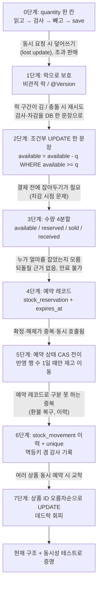
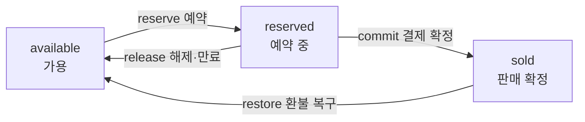

# 재고 설계의 진화 — 가장 단순한 구조에서 지금 구조까지

> 버전 0.1 · 2026-10-09 · 사유: 1-9(재고 예약) 구현 중, 면접에서 "왜 이런 구조인가"를 답할 수 있도록 설계 판단의 흐름을 정리

이 문서는 **새 결정을 내리지 않는다.** [ADR-008](../adr/ADR-008-inventory-reservation.md), [ERD product](03-erd.md), [로드맵 1-8·1-9](../03-roadmap/part1-foundation.md)에 이미 있는 결정을 "가장 단순한 구조 → 문제 → 개선"의 순서로 다시 풀어 쓴 것이다. 각 단계는 **그 단계에서 실제로 깨지는 상황**으로 시작한다. 면접에서는 구조를 외워서 말하지 말고, 이 문제들이 생긴 순서대로 말하면 된다.

## 0. 한눈에 보기



## 1. 먼저 알아둘 전제

| 사실 | 의미 |
|---|---|
| 재고 행은 상품당 1행이다 (`stock.product_id` PK) | 인기 상품이면 모든 요청이 **같은 행 하나**를 두고 경쟁한다. 모든 문제의 출발점이다. |
| PostgreSQL은 UPDATE가 행을 잡으면(행 락) **트랜잭션이 끝날 때까지** 다른 UPDATE를 기다리게 한다 | 락을 직접 코드로 걸지 않아도 UPDATE 자체가 줄을 세운다. |
| 기본 격리 수준 READ COMMITTED에서는 기다리던 UPDATE가 락을 얻은 뒤 **WHERE 조건을 최신 값으로 다시 평가**한다 | 조건부 UPDATE가 정확한 이유다(2단계). 프로젝트 격리 수준을 바꿨다면 이 가정이 달라진다(확인 필요). |
| 이 구조의 뼈대(조건부 UPDATE, 예약 CAS)는 원 프로젝트(As-Is) 팀원 구현에서 가져온 장점이다 | 면접에서는 "원 프로젝트를 분석해 **장점은 유지하고 결함 2개를 고쳐** 재설계했다"가 정직하고 강한 답이다. 아래 4·6단계가 그 결함 대응이다. |

## 2. 단계별 진화

### 0단계 — 가장 단순한 구조: 읽고, 검사하고, 빼고, 저장

```java
Stock stock = stockRepository.findById(productId);   // quantity = 1
if (stock.getQuantity() < q) throw new OutOfStock();
stock.decrease(q);                                    // quantity = 0
// 트랜잭션 커밋 시 dirty checking으로 UPDATE
```

**깨지는 상황:** 재고 1개, 두 사람이 동시에 주문한다.

| 시각 | 요청 A | 요청 B |
|---|---|---|
| t1 | 재고 읽음 → 1 | |
| t2 | | 재고 읽음 → 1 |
| t3 | 1 ≥ 1 통과, 0으로 저장 | |
| t4 | | 1 ≥ 1 통과, 0으로 저장 |

두 명 다 성공했는데 재고는 0이다. 1개가 2명에게 팔렸다(초과 판매). 읽은 시점과 쓰는 시점 사이에 다른 요청이 끼어든 것이 원인이다. 이를 lost update라고 부른다. 코드를 아무리 잘 짜도 "읽기 → 쓰기" 사이의 틈은 사라지지 않는다.

### 1단계 — 락으로 보호: 비관적 락 또는 `@Version`

| 방식 | 동작 | 한계 |
|---|---|---|
| 비관적 락 (`SELECT ... FOR UPDATE`) | 읽을 때 행을 잠가 다른 요청이 대기 | 읽기 → 검사 → 쓰기 → 커밋까지 **락을 오래 쥔다.** 인기 상품에서 대기열이 길어진다. 락 대기 시간 설정과 데드락도 신경 써야 한다. |
| 낙관적 락 (`@Version`) | 저장할 때 버전이 바뀌었으면 실패 | 경쟁이 심하면 **대부분이 실패하고 재시도**한다. 재고 100에 1,000명이면 재시도 폭풍이 된다. |

둘 다 **정확성은 지킨다.** 문제는 "검사"와 "차감"이 애플리케이션 코드에 있다는 점이다. 그래서 틈을 코드가 아니라 DB로 넘기는 방향을 찾았다.

> 원 프로젝트 노트(`docs/references/notes/interview-questions.md` 2.2)는 비관적 락을 썼다. 이 프로젝트는 락 대신 2단계를 택했고, 둘의 차이는 Stage 2에서 측정으로 비교한다(ADR-008의 B안).

### 2단계 — 조건부 UPDATE 한 문장 (현재 구조의 핵심)

```sql
UPDATE product.stock
   SET available = available - :q
 WHERE product_id = :id AND available >= :q
```

- **검사(`available >= q`)와 차감이 한 문장**이라 사이에 끼어들 틈이 없다.
- 동시 요청은 행 락에서 줄을 서고, 앞 요청이 커밋하면 뒤 요청은 **갱신된 값으로 WHERE를 다시 평가**한다. 재고가 부족해지면 조건이 거짓이 되어 **0행이 반영**된다.
- **반영 행 수가 곧 결과다.** 1이면 성공, 0이면 재고 부족. 별도 SELECT가 필요 없다.
- 엔티티를 읽지 않으므로 JPA dirty checking에 의한 덮어쓰기가 없다. 그래서 `Stock`/`StockReservation` 엔티티는 **읽기 전용**이고 쓰기는 모두 native UPDATE다. 여기서 엔티티로 `stock.decrease()` 후 저장하는 코드가 하나라도 섞이면 0단계의 문제가 다시 생긴다.

1-8의 재고 조정(`StockRepository.adjust`)도 같은 패턴이다: `available + delta >= 0`일 때만 반영하고, 0이면 `OUT_OF_STOCK`.

| 잘 되는 것 | 남는 한계 |
|---|---|
| 짧은 락, 단순한 코드, 재시도 불필요 | 인기 상품 한 행에 **락 대기가 집중**된다. Redis 차감·재고 버킷 분할은 이 한계를 줄이려는 대안이고, Stage 2에서 측정한다. |

### 3단계 — 수량을 4개로 나눈다: `available / reserved / sold / received`

**왜 필요한가:** 2단계의 `quantity` 한 칸으로는 **차감 시점**을 정할 수 없다.

| 시점 | 문제 |
|---|---|
| 주문 만들 때 바로 차감 | 결제를 안 한 사람이 재고를 영구 점유한다. 되돌릴 시점도 모호하다. |
| 결제 완료 후 차감 | 결제는 끝났는데 그 사이 다른 사람이 샀다 → "결제했는데 품절". 환불 처리까지 필요해진다. |

그래서 중간 상태인 **예약(결제 전에 임시로 잡아둠)**이 필요하고, 수량이 4칸으로 나뉜다.



- `received`(입고 누계)를 따로 둔 이유: **보존 법칙을 검사할 수 있게** 하려는 것이다. `available + reserved + sold = received`가 항상 성립해야 하고(INV-03: 재고 수량 합 불변식), 어느 한 칸이 틀어지면 합이 안 맞아 바로 드러난다. 이 점검이 `findProductIdsWithBrokenBalance()`다.
- 각 전이도 2단계와 같은 조건부 UPDATE다(`reserved >= q` 등). 음수가 되는 전이는 DB에서 거부된다.
- `sold`를 `received - available`로 계산하지 않고 따로 둔 이유: 환불 복구(`sold → available`)가 가능해야 하고, 예약 중인 수량과 판매 확정을 구분해야 하기 때문이다.

### 4단계 — 예약 레코드: `stock_reservation`

**깨지는 상황:** 3단계까지는 `reserved = 5`라는 숫자만 있다. 주문 서비스가 예약만 하고 죽으면 그 5개가 **누구 것인지, 언제 풀어야 하는지 알 수 없다.** 원 프로젝트의 결함이 바로 이것이다(CAT-01: 예약 만료가 없어 주문 서비스가 죽으면 재고가 영구 점유됨. docs/00-as-is/04-issues.md).

**해결:** 주문·상품 단위로 예약을 레코드로 남긴다.

| 컬럼 | 역할 |
|---|---|
| `order_id`, `product_id` (unique) | "이 주문의 이 상품"을 식별. **같은 주문이 두 번 예약하는 것을 DB가 막는다.** |
| `quantity` | 해제·확정 때 얼마를 옮길지의 근거 |
| `status` (`HELD/COMMITTED/RELEASED/EXPIRED`) | 지금 어느 단계인지 |
| `expires_at` + 인덱스 `(status, expires_at)` | 만료 스윕이 "HELD인데 시간이 지난 것"을 빨리 찾기 위함 (2-5에서 사용) |

만료 스윕을 주도하는 쪽은 주문 모듈이다(ADR-004). 상품 모듈은 `releaseReservation(orderId, EXPIRED)`만 제공한다.

### 5단계 — 예약 상태 CAS 전이

**깨지는 상황:** 확정과 해제는 다음 때문에 **중복·동시로 호출된다.**
- 네트워크 오류로 호출 측이 재시도한다.
- 결제 완료(commit)와 만료 스윕(release)이 같은 예약을 동시에 건드린다.

재고가 두 번 돌아오거나(`reserved`가 두 번 빠짐) commit과 release가 둘 다 적용되면 재고가 틀어진다.

**해결:** 예약의 상태 변경 자체를 조건부 UPDATE로 한다.

```sql
UPDATE product.stock_reservation
   SET status = :to, updated_at = :now
 WHERE id = :id AND status = :from      -- 예: from = HELD, to = COMMITTED
```

| 반영 행 수 | 의미 | 할 일 |
|---|---|---|
| 1 | 내가 HELD를 전이시킴 | `stock`의 수량을 옮기고 이력을 남김 |
| 0 | 이미 처리됐거나(중복) 다른 흐름이 먼저 바꿈 | **건너뜀.** 재고는 건드리지 않음 |

- **같은 트랜잭션**에서 예약 전이와 재고 이동을 하므로, 둘은 함께 커밋되거나 함께 롤백된다. 전이만 되고 재고는 안 움직이는 상태가 생기지 않는다.
- 전이가 1인데 재고 UPDATE가 0이면 `IllegalStateException`이다. HELD 예약이 있다면 `reserved >= q`가 항상 성립해야 하므로, 이건 불변식이 깨진 **버그**다.
- HELD만 대상이므로 이미 `COMMITTED`인 예약을 `release`해도 아무 일이 없다(결제 완료된 주문의 재고를 되돌리지 않는다).
- `@Version`(낙관적 락)이 아니라 CAS를 쓰는 이유: 낙관적 락은 충돌을 **예외**로 알려 재시도를 강제한다. 여기서 충돌은 오류가 아니라 "이미 처리됨"이라는 **정상 결과**이고, 0행이면 그냥 넘어가면 된다.

### 6단계 — 이력 `stock_movement`와 unique 제약

**깨지는 상황 1 — 환불 복구:** 환불 복구(`restore`)는 `COMMITTED`인 예약에 대해 일어난다. 그런데 예약 상태는 이미 종결이라 5단계 CAS로 "이 환불을 처리했는가"를 구분할 수 없다. 한 주문에서 **부분 환불이 여러 번** 올 수 있어서 "예약당 1회"로 막을 수도 없다. 구분 기준은 **환불 ID**다.

**깨지는 상황 2 — 판매자 재고 수정:** 원 프로젝트는 판매자가 "재고를 N으로" 덮어썼다. 그 사이 들어온 예약 차감이 사라진다(CAT-06: 절대값 덮어쓰기로 동시 예약 차감이 유실됨). 그래서 `delta`(증감량)만 받고(`available += delta, received += delta`), 모든 변화를 기록한다.

**해결:** 수량이 바뀔 때마다 `stock_movement`에 한 줄을 남기고, `unique(type, ref_type, ref_id, product_id)`를 둔다.

- `INSERT ... ON CONFLICT DO NOTHING` → 반환 1이면 새 기록, 0이면 이미 있음. 이 값이 멱등 판단이 된다.
- 예: 복구는 `(RESTORE, REFUND, refundId, productId)`. 같은 환불로 두 번째 복구하면 INSERT가 0이라 `return`.
- **`restore`는 이력 INSERT를 먼저 한다.** 동시에 같은 `refundId`가 두 번 오면 PostgreSQL이 뒤 INSERT를 앞 트랜잭션이 끝날 때까지 기다리게 하고, 끝나면 충돌로 0을 돌려준다. 즉 unique 제약이 "처리했다"는 **기록이면서 잠금** 역할을 한다. 순서를 바꿔 재고 UPDATE를 먼저 하면 두 요청 모두 재고를 올릴 수 있다.
- 정합성 점검: `stock`의 수량과 `stock_movement` 합계를 대조할 수 있다(ERD INV-03 설명).

### 7단계 — 여러 상품 예약과 데드락

체크아웃은 한 주문에 **여러 상품**을 예약한다. 상품마다 행 락을 잡으므로 순서가 엇갈리면 교착이 난다.

| 시각 | 주문 X (A, B 순서) | 주문 Y (B, A 순서) |
|---|---|---|
| t1 | A 행 락 획득 | B 행 락 획득 |
| t2 | B 락 대기 (Y가 쥐고 있음) | A 락 대기 (X가 쥐고 있음) |

서로 상대를 기다리므로 DB가 데드락을 감지해 한쪽을 죽인다(`CannotAcquireLockException` 등).

**해결:** 입력 순서와 무관하게 **항상 상품 ID 오름차순**으로 UPDATE한다. 모두가 같은 순서로 잠그면 순환 대기가 생길 수 없다. 이 규칙은 `reserve`뿐 아니라 여러 행을 잠그는 모든 곳에 해당한다. `ReservationDeadlockTest`가 `@RepeatedTest(50)`으로 확인한다.

**여러 상품 중 하나가 부족하면?** `OUT_OF_STOCK` 예외가 트랜잭션을 롤백하므로, 앞에서 줄인 재고도 함께 되돌아간다("전부 되거나 전부 안 되거나"). `reserve`는 호출자 트랜잭션에 합류하므로, 호출자가 이 예외를 삼키면 안 된다.

## 3. 지금 구조에서 `reserve`가 하는 일 (순서와 이유)

| 순서 | 동작 | 이유 |
|---|---|---|
| 1 | 입력 검증 (비어 있음, 수량 ≤ 0, 상품 중복 → `IllegalArgumentException`) | 호출한 쪽(내부 코드)의 버그이므로 비즈니스 오류가 아니라 예외 |
| 2 | `existsByOrderId` → 있으면 return | 재시도에 안전(멱등). 단, 동시 호출은 여기서 못 막는다 |
| 3 | 상품이 모두 존재하고 `ON_SALE`인지 확인 | 단종 상품 예약 방지(CAT-02: 원 프로젝트는 판매 상태를 검증하지 않아 단종 상품도 주문됨) |
| 4 | 상품 ID 오름차순 정렬 | 데드락 회피 (7단계) |
| 5 | 상품마다 조건부 UPDATE `reserve` → 0이면 `OUT_OF_STOCK` | 재고 판단은 DB에게 (2단계) |
| 6 | 상품마다 예약 INSERT + `RESERVE` 이력 | 근거 레코드(4단계), 감사·멱등(6단계) |

2번의 틈은 **unique 제약이 메운다.** 같은 `orderId`가 동시에 두 번 오면 둘 다 2번을 통과할 수 있지만, 늦은 쪽은 `uk_stock_reservation_order_product` 위반으로 실패하고 전체가 롤백된다. 재고는 한 번만 줄어든다. **선조회(빠른 경로)와 unique 제약(최종 방어선)을 같이 두는 이유가 이것이다.**

## 4. 멱등 판단 방법은 연산마다 다르다

| 연산 | 멱등 판단 | 0이 나오는 곳 |
|---|---|---|
| `reserve` | `existsByOrderId` + `uk_stock_reservation_order_product` | (unique 위반 시 예외) |
| `commitReservation`, `releaseReservation` | 예약 상태 CAS | `transit` 반영 행 수 |
| `restore` | `stock_movement` unique (`refundId`) | 이력 INSERT 반영 행 수 |

## 5. 왜 이렇게 테스트하는가

| 테스트 | 증명하는 것 |
|---|---|
| `StockReservationConcurrencyTest` | 재고 100에 서로 다른 주문 1,000건이 동시에 예약 → **정확히 100건 성공**, `available 0 / reserved 100`, `available + reserved + sold = received`. 이 프로젝트의 첫 동시성 증거 |
| `ReservationDeadlockTest` | 주문 X는 [A,B], Y는 [B,A] 순서로 동시에 → 둘 다 성공, 데드락 예외 없음 |
| `StockAdjustmentConcurrencyTest` (1-8) | 동시 입고 +1을 100건 → 정확히 +100 |

동시성 테스트는 "한 번 통과"로는 부족하다. 스레드를 `CountDownLatch`로 동시에 출발시키고 **결과와 불변식**(정확히 100건, 합 일치)으로 검증한다.

## 6. 면접 예상 질문과 답의 뼈대

| 질문 | 답의 뼈대 |
|---|---|
| 재고 동시성을 어떻게 풀었나요? | 읽고 검사하고 쓰면 사이에 틈이 생기니(lost update) 검사와 차감을 **조건부 UPDATE 한 문장**으로 합쳤다. 반영 행 수 0이면 재고 부족. 100개에 1,000건 동시 테스트로 정확히 100건 성공을 확인했다. |
| 왜 비관적 락·`@Version`이 아닌가요? | 비관적 락은 읽기~커밋까지 락이 길고, `@Version`은 경쟁이 심하면 재시도 폭풍이다. 조건부 UPDATE는 락이 UPDATE 한 문장 구간이고 재시도가 없다. **다만 성능 우열은 Stage 2에서 측정해 비교할 계획**이라 지금은 "정확성과 단순성"을 근거로 한다. |
| 서버가 여러 대여도 안전한가요? | 동시성 제어를 JVM 락이 아니라 **DB 행 락**에 맡겼으므로 서버 수와 무관하다. |
| 왜 재고를 4개로 쪼갰나요? | 결제 전 임시 점유(예약)가 필요해서다. 합 불변식을 검사 가능하게 하려고 `received`를 뒀다. |
| 예약 레코드는 왜 필요한가요? | 만료와 되돌림의 근거다. 숫자만 있으면 서비스가 죽었을 때 누구 것을 풀어야 하는지 알 수 없다(원 프로젝트의 영구 점유 결함). |
| 확정과 만료가 동시에 오면요? | 둘 다 `WHERE status = 'HELD'` CAS로 전이한다. 행 락 덕분에 한쪽만 1을 받고 다른 쪽은 0이라 건너뛴다. 재고는 한 번만 움직인다. |
| 같은 요청이 두 번 오면요? | 연산마다 방법이 다르다. 예약은 선조회 + unique, 확정·해제는 CAS 행 수, 복구는 환불 ID unique 이력. |
| 데드락은 어떻게 막았나요? | 여러 상품을 항상 상품 ID 오름차순으로 잠가 순환 대기를 없앴다. 50회 반복 테스트로 확인했다. |
| 이 구조의 한계는요? | 인기 상품 한 행에 락 대기가 몰린다. Stage 2에서 `SELECT FOR UPDATE`(기준선), Redis 원자 차감, 재고 버킷 분할을 같은 조건(재고 100에 1,000건)으로 TPS·p95·락 대기 시간을 측정해 비교하고 ADR을 갱신한다. |

## 7. 각 개념이 코드·문서의 어디에 있나

| 개념 | 위치 |
|---|---|
| 수량 4분할, 불변식, 이력 unique | [ERD product](03-erd.md), `product/domain/Stock.java`, `V202610070056__product_create_product.sql` |
| 재고 조정(증감) | 로드맵 1-8, `AdjustStockService`, `StockRepository.adjust` |
| 예약 테이블 | `V202610090100__product_create_stock_reservation.sql` |
| 예약 상태 전이 규칙 | [04-state-machines.md](04-state-machines.md), `transit`의 `WHERE status = :from` (enum에는 전이표가 없다) |
| 예약·확정·해제·복구 규격 | 로드맵 1-9 `ProductApiImpl` 절 (구현 중) |
| 결정과 Stage 2 대안 | [ADR-008](../adr/ADR-008-inventory-reservation.md) |

## 8. 이 문서를 읽고 스스로 답해 볼 것

1. `ReservationStatus`에서 `RELEASED`와 `EXPIRED`를 둘 다 두는 이유는? (힌트: 사유별 통계, 원인 추적)
2. `commitReservation`에서 `transit`이 1인데 `stockRepository.commit`이 0이면 왜 예외인가? 건너뛰면 안 되는가?
3. `restore`가 이력 INSERT를 먼저 하는 이유를, 순서를 바꿨을 때 깨지는 상황으로 설명해 보라.
4. `getPurchasable`(조회)과 `reserve`(쓰기)가 둘 다 판매 상태를 확인하는 이유는? (조회 시점과 예약 시점 사이에 상태가 바뀔 수 있다)
