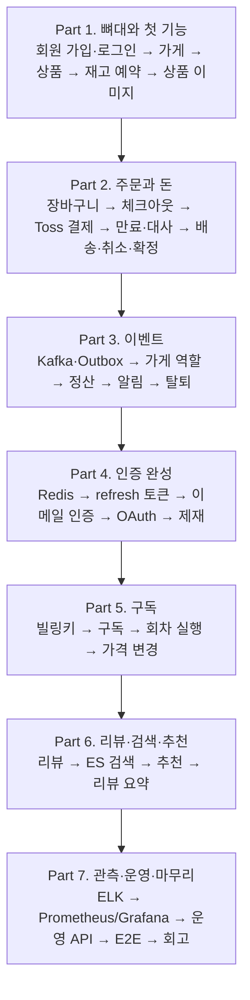

# Phase 3. 구현 로드맵

> 버전 0.9 · 2026-10-10 · Part 1 완료 반영: 남은 "확인 필요" 해소, 검증 메시지 표준 문구·알려진 한계 정리, Part 2 시작 전 결정 항목(`subscribable`) 추가 / 0.8 · 2026-10-10 · 1-11 "할 일"을 S1~S8 순서로 재구성(규격과 방법을 합침) / 0.7 · 2026-10-09 · 1-11~Part 7 점검: 구현된 Part 1 코드(모듈 API·`TestFixtures`·토큰 결과 타입)와 이름을 맞추고, 각 Part의 라이브러리·이미지 버전을 Maven Central·Docker Hub로 확인해 확정, 1-11 배포 규격을 호출 형태 수준으로 구체화 / 0.6 · 2026-10-09 · 1-10 MinIO 이미지를 Chainguard 빌드로 교체(공식 이미지 Docker Hub 삭제) / 0.5 · 2026-10-07 · Part 1에 1-11(운영 환경 연습: VM 배포·자동 CD) 추가 / 0.4 · 2026-10-02 · 예치금 제거(Part 2를 10단계로 다시 번호 매김), 1-10 상품 이미지 추가 / 0.3 · Part 1~7을 "다른 문서를 보지 않고 로드맵만으로 개발할 수 있는" 수준으로 구체화 · 근거: [01-requirements](../01-requirements/README.md), [02-design](../02-design/README.md), [개발 가이드](../development-guide.md), [Git 정책](../git-policy.md)

## 1. 이 로드맵을 읽는 법

**기능부터 만들고, 도구는 필요해지는 순간에 도입한다.**
처음부터 Kafka·Redis·ELK를 깔지 않는다. 각 도구는 "이게 없으면 이런 문제가 생긴다"는 상황이 처음 나오는 단계에서 등장하고, 그 단계 문서가 왜 필요한지 설명한다.

- **Part**: 큰 묶음. Part가 끝날 때마다 develop → main 릴리스(`v0.{Part}.0`)를 한다.
- **단계(step)**: `Part-번호`(예: `2-2`). **단계 하나 = 브랜치 하나 = PR 하나 = 리뷰 하나.** 브랜치명 `feature/2-2-checkout`.
- 단계 문서의 구성

| 항목 | 내용 |
|---|---|
| 목표 | 이 단계가 끝나면 할 수 있게 되는 것 |
| 왜 지금 | 이 단계가 여기 있는 이유, 앞 단계와의 연결 |
| 새로 등장 | 처음 나오는 개념·도구와 짧은 설명, 더 읽을 곳 |
| 할 일 | 순서대로 진행할 작업 목록 |
| 완료 확인 | 통과해야 할 테스트, 직접 호출해 볼 요청 |
| 리뷰 때 물어볼 것 | 제가 리뷰하면서 물어볼 질문. 미리 답을 생각해 두면 면접 준비가 된다 |

- **문서 작업은 Claude가 한다.** 단계의 "할 일" 중 `(Claude)` 표시가 붙은 항목(README, 호환성 표, PR 템플릿, 설계 문서 반영 등)은 리뷰 때 Claude가 사용자 브랜치에 직접 수정하고, 사용자는 그 변경을 확인해서 커밋한다.
- 모든 Part를 **로드맵만 보고 개발할 수 있게** 구체화했다: 각 Part 앞의 "공통 규칙"(Part 1의 A~I가 기본, 이후 Part는 추가분만)과 단계별 "정책 / 할 일(구현 규격) / 완료 확인(테스트 클래스·케이스)". 그래도 각 Part를 시작하기 전에 앞 Part에서 배운 것을 반영해 다시 다듬는다.
- **리뷰 기준**: 리뷰는 단계 문서의 구현 규격·완료 확인·공통 규칙과 개발 가이드에 근거가 있는 것만 지적한다. 근거 없는 의견은 "제안"으로 분리한다. 문서가 모호해서 판단이 갈리면 지적 대신 문서를 먼저 고친다.
- **확인 필요** 표시는 Boot 4 등 최신 버전에서 동작을 확인하지 못한 부분이다. 막히면 우회하지 말고 알려 주면 문서를 고친다.

## 2. 전체 흐름

| Part | 문서 | 단계 | 끝나면 할 수 있는 것 |
|---|---|---|---|
| 1 | [뼈대와 첫 기능](part1-foundation.md) (완료) | 11 | 가입·로그인하고, 가게를 열고, 상품(이미지 포함)을 올리고, 재고를 동시성 문제 없이 예약한다. 머지하면 VM에 자동 배포된다 |
| 2 | [주문과 돈](part2-order-money.md) | 10 | 여러 가게 상품을 카드(Toss)로 결제하고, 배송·취소·구매확정까지 간다 |
| 3 | [이벤트](part3-events.md) | 6 | 후속 작업(역할 변경, 정산, 알림)이 비동기로 안전하게 처리된다 |
| 4 | [인증 완성](part4-auth.md) | 4 | OAuth 로그인, 이메일 인증, 토큰 탈취 대응, 즉시 차단 |
| 5 | [구독](part5-subscription.md) | 4 | 정기 구독 결제가 중복 없이 돈다 |
| 6 | [리뷰·검색·추천](part6-review-search.md) | 6 | 리뷰, 검색, AI 추천, 리뷰 요약 |
| 7 | [관측·운영·마무리](part7-ops-wrapup.md) | 5 | 로그·메트릭·알림으로 운영하고, Stage 1을 마무리한다 |

**시간이 부족할 때**: Part 1 → 2 → 3(3-4 정산까지)이 "주문하고 판매 대금이 정산되는" 핵심이다. Part 5·6은 줄일 수 있다.

## 3. 무엇이 언제 등장하나

| 단계 | 인프라·도구 | 개념·패턴 |
|---|---|---|
| 1-1 | Spring Boot 4, Java 25, Docker(Postgres), Flyway, Git Flow | 프로젝트 구조, 프로필, 시크릿 관리 |
| 1-2 | Testcontainers, GitHub Actions | 통합 테스트, CI |
| 1-3 | Spring Security(PasswordEncoder) | 엔티티 작성법(DDD), 4계층 패키지, 공통 에러 응답, traceId |
| 1-4 | JWT | 무상태 인증, `@CurrentMember` |
| 1-6 | Spring Modulith | 모듈 경계, 모듈 공개 API, 소유권 인가 |
| 1-7 | - | 모듈 간 호출, `Money` 값 객체, keyset 페이징 |
| 1-8 | - | 상태 전이 규칙, 낙관적 락(`@Version`), 조건부 UPDATE |
| 1-9 | - | 재고 예약, **동시성 테스트** |
| 1-10 | **MinIO**(S3 호환, Chainguard 이미지), AWS SDK S3 | presigned URL 업로드, 외부 저장소 호출은 트랜잭션 밖 |
| 1-11 | Proxmox VM, Docker Compose 배포, GHCR, **GitHub Actions self-hosted runner** | 자동 CD, sha 태그 이미지, 헬스체크·자동 롤백, public 리포의 러너 보안 |
| 2-1 | - | upsert(`ON CONFLICT DO UPDATE`), 배치 조회 |
| 2-2 | - | 애그리거트, 여러 모듈을 하나의 트랜잭션으로, **멱등 API** |
| 2-3 | Toss API, 가짜 PG 서버(JDK HttpServer) | 외부 API 결과 3분류(성공/실패/불확실), 타임아웃 |
| 2-4 | - | **트랜잭션 밖 외부 호출**, CAS 상태 전이 |
| 2-5 | - | 스케줄 작업, **advisory lock(잡 락)** |
| 2-6 | - | **대사(reconciliation)** |
| 2-8 | - | 환불 오케스트레이션, 보상, 복구 잡 |
| 3-1 | **Kafka** | 이벤트가 필요한 이유, **Transactional Outbox** |
| 3-2 | - | 멱등 소비(Inbox), 재시도·DLT, 의존 역전 |
| 4-1 | **Redis** | refresh 토큰 회전·재사용 탐지 |
| 4-3 | OAuth | 외부 인증 연동 |
| 5-1 | Toss 빌링 | 정기결제 |
| 6-2 | **Elasticsearch** | 검색 색인(읽기 모델), alias 재색인 |
| 6-4 | pgvector, Spring AI | 임베딩, 유사도 검색 |
| 7-1 | **ELK** | 로그 수집, traceId 검색 |
| 7-2 | **Prometheus, Grafana** | 메트릭, 대시보드, 알림 |
| Stage 2 | **k6** | 부하 테스트, 성능 개선 |

## 4. 공통 완료 기준 (모든 단계)
- [ ] CI 통과 (빌드 + 전체 테스트, 1-6 이후는 Modulith verify 포함)
- [ ] 단계의 "완료 확인" 테스트를 모두 작성했고, **일부러 코드를 깨뜨렸을 때 테스트가 실패하는 것을 확인**했다
- [ ] [개발 가이드 §19](../development-guide.md) 금지 패턴이 없다
- [ ] 설계와 다르게 만든 부분을 PR 본문에 적었다 (문서 반영은 리뷰 때 Claude가 한다)
- [ ] PR 템플릿([Git 정책 §4.3](../git-policy.md))을 채웠다

## 5. 미결 정책 (해당 단계 시작 전에 결정)
**권장안으로 진행**한다. 바꾸려면 해당 단계 시작 전에 알려주고, [요구사항 §2](../01-requirements/README.md)에 정책으로 추가한다.

| ID | 질문 | 권장안 | 결정 시점 |
|---|---|---|---|
| OPEN-01 | 탈퇴한 회원이 같은 이메일·소셜 계정으로 다시 가입하면? | 새 회원으로 재가입 허용 (탈퇴 시 이메일 마스킹·소셜 연결 해제) | 3-6 |
| OPEN-02 | 같은 refresh로 동시에 두 번 갱신 요청이 오면? | 재사용으로 판단해 세션 묶음 폐기 (엄격) | 4-1 |
| OPEN-03 | 반품이 거절된 품목을 다시 반품 요청할 수 있나? | 불가 (이후는 문의로) | 2-9 |
| OPEN-04 | 활성 구독이 쓰는 빌링키를 삭제하면? | 409로 거부 | 5-1 |
| OPEN-05 | 구독 상품 가격이 내려가면? | 다음 회차부터 바로 적용 | 5-4 |
| OPEN-06 | 정산 수수료의 원 단위 미만은? | 내림 | 3-4 |
| OPEN-07 | 정산 대기 금액이 있는 판매자가 탈퇴하면? | 불가 | 3-6 |

## 6. Stage 1.5·2·3
**Stage 1.5(k3s 전환·무중단 배포)**는 Stage 1 완료 후, Stage 2 시작 전에 한다([ADR-012](../adr/ADR-012-kubernetes-zero-downtime.md), 단계 K-1~K-5). 착수 전에 로드맵 문서로 구체화한다.

Stage 2·3은 Stage 1(Part 1~7)이 끝나면 측정 결과를 보고 작성한다. 개요는 [01-architecture-evolution](../02-design/01-architecture-evolution.md).
