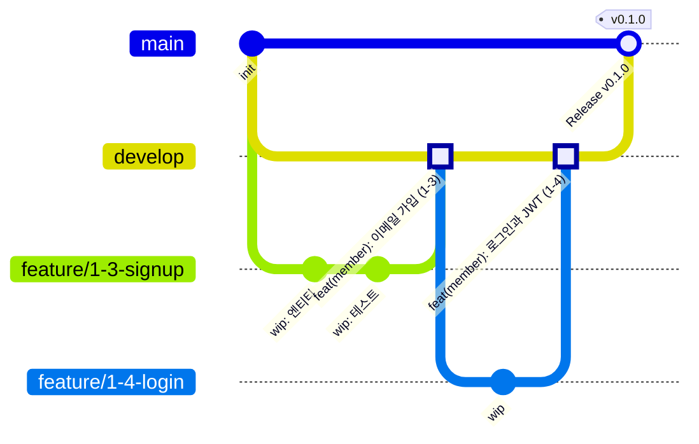

# Git 정책 (MyRoutin v2)

> 브랜치, 커밋, PR, 릴리스 규칙. 1인 개발이지만 **팀 개발과 같은 절차**로 진행해서, 이력(커밋·PR)만 봐도 무엇을 왜 바꿨는지 알 수 있게 한다.
> 관련: [개발 가이드](development-guide.md), [로드맵](03-roadmap/README.md)

## 1. 브랜치 전략: Git Flow (간소화)

| 브랜치 | 역할 | 만드는 곳 | 합치는 곳 | 합치는 방식 |
|---|---|---|---|---|
| `main` | 릴리스된 버전만. 태그가 붙는다 | - | - | - |
| `develop` | 개발 통합 브랜치. **GitHub 기본 브랜치** | `main`에서 한 번 | Part가 끝나면 `main`으로 | **merge commit** |
| `feature/*` | 로드맵의 단계(step) 하나 | `develop` | `develop` | **squash merge** |
| `hotfix/*` | `main`에서 발견된 긴급 수정 | `main` | `main` → 이후 `main`을 `develop`에 반영 | squash merge |



**왜 feature → develop은 squash, develop → main은 merge commit인가**
- squash merge는 feature 브랜치의 자잘한 커밋들("wip", "오타 수정")을 **커밋 하나로 합쳐** develop에 올린다. develop 이력이 "단계 하나 = 커밋 하나"가 되어 읽기 쉽다.
- develop → main까지 squash하면 main에는 develop과 **내용은 같지만 다른 커밋**이 생긴다. 다음 릴리스 때 Git이 두 브랜치를 다른 이력으로 보고 충돌을 낸다. 그래서 릴리스는 merge commit으로 develop의 커밋을 그대로 가져간다.

**release 브랜치는 만들지 않는다.** 1인 개발이라 "Part 완료 = 릴리스"로 충분하다. 릴리스 직전 수정은 develop에서 하고 바로 main으로 합친다.

## 2. 브랜치 이름
```
feature/{단계ID}-{짧은-설명}     feature/2-4-checkout
hotfix/{짧은-설명}              hotfix/jwt-expiry-check
docs/{짧은-설명}                docs/adr-011-cache        (문서만 바꿀 때)
```
- 단계ID는 [로드맵](03-roadmap/README.md)의 번호(`Part-단계`)다.
- 영어 소문자와 하이픈만 쓴다.
- 한 단계가 커서 PR을 나누면 `feature/2-11a-cancel-line`, `feature/2-11b-refund-recovery`처럼 알파벳을 붙인다.

## 3. 커밋 메시지

### 3.1 형식
```
{type}({scope}): {제목}

{본문: 무엇을, 왜. 어떻게는 코드가 말한다}

Refs: {단계ID}
```

| 요소 | 규칙 |
|---|---|
| type | `feat` 기능, `fix` 버그 수정, `refactor` 동작 변화 없는 구조 개선, `test` 테스트만, `docs` 문서, `chore` 설정·의존성, `ci` CI, `perf` 성능 개선(Stage 2) |
| scope | 모듈명(`member`, `shop`, `product`, `order`, `payment`, `wallet`, `settlement`, `review`, `search`, `recommendation`, `notification`, `common`) 또는 `infra`, `docs` |
| 제목 | 한국어, 50자 이내, 마침표 없음. "무엇을 했다"가 드러나게 (`추가`, `수정`, `제거`) |
| 본문 | 선택. 왜 바꿨는지, 고려한 대안, 주의점. 한 줄 72자 내외 |
| Refs | 로드맵 단계ID, 관련 결함·ADR (`Refs: 2-11, ORD-04, ADR-004`) |

### 3.2 예시
```
feat(order): 체크아웃 - 예치금 전액 결제

주문 3단 구조(주문-가게주문-품목)로 생성하고, 재고 예약과 예치금 보류를
하나의 트랜잭션으로 묶었다. 가격은 클라이언트 값이 아니라 상품 모듈에서
조회한 서버 가격으로 확정한다 (As-Is ORD-01 재발 방지).

Refs: 2-4, ADR-004
```
```
fix(wallet): 같은 주문으로 보류를 다시 요청하면 예외 대신 기존 결과 반환

Refs: 2-2, WAL-01
```
```
perf(order): 주문 목록 조회에 커버링 인덱스와 keyset 페이징 적용

p95 1.2s → 80ms (k6, 300 VU). 측정 리포트: docs/perf/02-order-list.md

Refs: S2-M2
```

### 3.3 커밋 단위
- feature 브랜치 안에서는 자유롭게 커밋한다(나중에 squash된다). 다만 **관련 없는 변경은 다른 커밋으로** 나눈다. 리뷰할 때 커밋별로 보기 쉽다.
- **develop에 남는 메시지는 PR 제목**이다(squash merge). 그래서 PR 제목을 3.1 형식으로 쓴다.
- 포맷팅만 바꾼 변경은 기능 변경과 섞지 않는다.

## 4. PR 규칙

### 4.1 흐름
```
1. develop 최신화 후 브랜치 생성       git switch develop && git pull && git switch -c feature/2-4-checkout
2. 작업·커밋
3. PR 전 develop 변경 반영              git fetch origin && git rebase origin/develop
4. 셀프 체크리스트 확인 (4.3)
5. push 후 PR 생성 (base: develop)      git push -u origin feature/2-4-checkout
6. CI 통과 확인 → Claude에게 리뷰 요청  "2-4 리뷰해줘" + 브랜치명 또는 PR 번호
7. 리뷰 반영은 새 커밋으로 추가          (리뷰 중에는 force push 하지 않는다 → 무엇을 고쳤는지 보이게)
8. 승인되면 squash merge, 브랜치 삭제
```

### 4.2 기준
- **단계 하나 = PR 하나.** 변경이 테스트 제외 500줄을 넘으면 나눌 수 있는지 먼저 검토한다.
- PR 제목: `feat(order): 체크아웃 - 예치금 전액 결제 (2-4)`
- CI(빌드 + 전체 테스트)가 통과하지 않은 PR은 리뷰를 요청하지 않는다.
- 설계와 다르게 구현했으면 같은 PR에서 문서도 고친다.

### 4.3 PR 템플릿
`.github/pull_request_template.md`로 저장한다.
```markdown
## 단계
- 로드맵: (예: 2-4 체크아웃 - 예치금 전액 결제)

## 무엇을 / 왜
-

## 완료 기준 체크
- [ ] 단계 문서의 "완료 확인" 항목을 모두 통과했다
- [ ] 필수 테스트를 모두 작성했고, 일부러 깨뜨려 실패하는 것을 확인했다
- [ ] 개발 가이드 §19 금지 패턴이 없다
- [ ] 설계와 달라진 부분이 있으면 문서에 반영했다 (없으면 "없음")
- [ ] Flyway 마이그레이션이 빈 DB에서 적용된다

## 설계와 다른 점
- 없음

## 리뷰어가 특히 봐줬으면 하는 곳
-

## 테스트 결과
- 실행한 테스트:
- 직접 호출 확인 (curl 등):
```

## 5. 동기화와 히스토리 규칙
- `develop`, `main`은 **절대 rebase·force push하지 않는다.**
- 내 feature 브랜치는 PR 전까지 `git rebase origin/develop`으로 최신화하고 `git push --force-with-lease`로 올려도 된다. 리뷰가 시작되면 rebase하지 않고, 충돌이 나면 `git merge origin/develop`으로 해결한다.
- `git push --force`(lease 없이)는 쓰지 않는다.

## 6. GitHub 저장소 설정
| 설정 | 값 |
|---|---|
| 기본 브랜치 | `develop` |
| 브랜치 보호 (`main`, `develop`) | PR 필수, CI 상태 체크 통과 필수, force push 금지, 삭제 금지 |
| 머지 방식 허용 | squash merge(feature용), merge commit(릴리스용). rebase merge는 끈다 |
| 머지 후 브랜치 자동 삭제 | 켬 |
| Secret scanning / push protection | 켬 (시크릿 커밋 차단) |

> 1인 개발이라 "리뷰 승인 필수"는 켤 수 없다(본인 PR을 본인이 승인할 수 없음). 대신 Claude 리뷰가 끝나야 머지한다는 규칙을 지킨다.

## 7. 릴리스와 태그
| 시점 | 태그 | 방법 |
|---|---|---|
| Part 1~7 각각 완료 | `v0.1.0` ~ `v0.7.0` | develop → main PR(merge commit) → main에 태그 → GitHub Release |
| Stage 1 완료 | `v1.0.0` | 위와 같음 |
| Stage 2 개선 단위 | `v1.1.0`, `v1.2.0` … | 측정 리포트 링크를 Release 노트에 |
| Stage 3 MSA 전환 | `v2.0.0` | |
| main 긴급 수정 | PATCH 증가 (`v0.3.1`) | hotfix 브랜치 |

Release 노트에는 완료한 단계 목록, 주요 설계 결정(ADR), 알려진 한계를 쓴다. 이력서 링크로 쓸 수 있게 정리한다.

## 8. 커밋하지 않는 것
| 대상 | 처리 |
|---|---|
| `.env`, 키 파일, 인증서 | `.gitignore`. 키 이름은 `.env.example`에 |
| `build/`, `out/`, `.gradle/` | `.gitignore` |
| `.idea/`, `*.iml`, `.DS_Store` | `.gitignore` (코드 스타일 공유가 필요하면 `.editorconfig`로) |
| 로그, 로컬 DB 볼륨, k6 결과 원본(JSON) | `.gitignore`. 결과 요약만 `docs/perf/`에 |
| 대용량 시드 데이터 | 생성 스크립트만 커밋 |

**시크릿을 실수로 커밋했다면**: 히스토리를 지우는 것보다 **키를 즉시 폐기·재발급**하는 것이 먼저다. 이미 push된 시크릿은 노출된 것으로 본다(As-Is MEM-01).

## 9. 처음 저장소를 만들 때 (로드맵 1-1에서 진행)
start.spring.io zip은 **폴더째가 아니라 내용물을** 리포 루트(`myroutine-v2/`)에 둔다. `build.gradle`, `src/`가 `docs/`, `CLAUDE.md`와 같은 위치에 있어야 한다.

```bash
# 1) 생성한 프로젝트의 내용물(숨김 파일 포함)을 리포 루트로
cd ~/Downloads && unzip myroutine.zip
cp -R ~/Downloads/myroutine/. ~/Desktop/my_routin/myroutine-v2/
cd ~/Desktop/my_routin/myroutine-v2

# 2) .gitignore에 8절 항목 추가(.env, .idea/, .DS_Store 등), README.md 작성

# 3) main 첫 커밋은 문서만
git init -b main
git add .gitignore README.md CLAUDE.md docs/
git commit -m "docs: 설계 문서와 저장소 초기화"
git switch -c develop
# GitHub 저장소 생성 후
git remote add origin {저장소 URL}
git push -u origin main develop
# GitHub에서 기본 브랜치 develop으로 변경, 6절의 보호 규칙 설정

# 4) 프로젝트 코드는 feature 브랜치 → PR로
git switch -c feature/1-1-project-setup
git add .
git status        # .env, .idea, build/ 가 없는지 확인
git commit -m "chore(infra): Spring Boot 프로젝트 생성"
```
