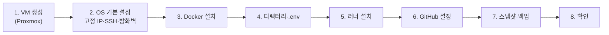

# 운영 환경 VM 준비 가이드 (Proxmox + Docker + Actions runner)

> 버전 0.3 · 2026-10-10 · VM이 처음인 경우를 위해 §1-1(ISO 준비·VM 생성·Ubuntu 설치 순서) 추가, RAM을 호스트 24GB에 맞춰 16GB로 변경
> 0.2 · 2026-10-09 · OS 버전·ufw 우회·러너 토큰 만료·`svc.sh` 인자·포크 PR 승인 메뉴 이름을 공식 문서로 확인해 확정, `.env` 키 이름을 1-11의 `.env.ops.example`(로컬과 같은 `SPRING_DATASOURCE_*`)에 맞춤
> 0.1 · 2026-10-07 · 로드맵 [1-11](../03-roadmap/part1-foundation.md)의 "0) VM 준비" 절차. 결정 근거는 [ADR-011](../adr/ADR-011-ops-practice-environment.md).
> 이 문서의 명령은 VM에서 **직접 실행해 검증한 것이 아니다.** 메뉴 이름·옵션 중 공식 문서로 확인한 것은 날짜를 적었고, 확인하지 못한 곳은 "확인 필요"로 남겼다. 다르면 이 문서를 고치게 알려 달라.

## 0. 전체 순서



## 1. VM 생성 (Proxmox)

| 항목 | 값 | 이유 |
|---|---|---|
| 이름 | `myroutine-ops` | |
| OS | Ubuntu Server 26.04 LTS | Docker Engine 설치 문서의 지원 목록에 22.04·24.04·26.04가 있다(2026-10-09 확인). 앱 이미지 `eclipse-temurin:25-jre`도 26.04 기반 |
| vCPU | 8~10, CPU 타입 `host` | 호스트 16코어 중 일부는 Proxmox와 다른 VM용으로 남긴다 |
| RAM | 16GB, **Ballooning 끔** | 호스트 RAM이 24GB이고 증설할 수 없다. Proxmox 자체와 캐시용으로 8GB를 남긴다(20GB를 주면 호스트가 스왑에 들어갈 수 있다). ES·Kafka가 메모리를 한 번에 잡는다. 줄었다 늘었다 하면 OOM 원인이 된다. 실사용량은 7-1(ELK) 때 측정해서 조정 |
| 디스크 | 100GB, VirtIO SCSI, (SSD면) Discard 켬 | 이미지·Postgres·ES·MinIO 볼륨 |
| 네트워크 | VirtIO, 브릿지 `vmbr0` | 집 LAN에서 바로 접근 |
| QEMU Guest Agent | 옵션에서 켬 | Proxmox가 IP 확인·안전한 종료·스냅샷을 할 수 있다 |

- 이 VM은 **이 프로젝트 전용**으로 쓴다. 러너의 docker 권한은 사실상 root라서 다른 중요한 데이터를 같이 두지 않는다(ADR-011 §3).
- 나중에 쿠버네티스로 가면 이 VM을 그대로 쓰지 않고 **새 VM을 만드는 쪽**이 자연스럽다(아래 §9). 그래서 지금 VM에 Proxmox 스냅샷을 잘 남겨 둔다.

### 1-1. 만드는 순서 (VM이 처음이라면)

> LXC 컨테이너는 호스트 커널을 빌려 쓰지만, VM은 **가상의 컴퓨터에 OS를 직접 설치**한다. 그래서 "설치 ISO 준비 → VM 생성 → 콘솔에서 Ubuntu 설치"의 세 단계가 더 있다. 메뉴·화면 이름은 Proxmox·Ubuntu 버전에 따라 조금 다를 수 있다(확인 필요).

**① 설치 ISO 준비**
- Proxmox 왼쪽 트리에서 스토리지 `local` → **ISO Images** → **Download from URL**에 `https://releases.ubuntu.com/26.04/ubuntu-26.04.1-live-server-amd64.iso`(2026-10-10 공식 사이트에서 확인, 약 2.9GB)를 넣고 *Query URL* → *Download*. 체크섬(SHA-256) `cc8a95cde20f6ced61a322420de00f10cc3c90ced545daa46cb9c1a117f1d927`을 *Checksum*에 넣으면 검증된다(같은 폴더의 `SHA256SUMS`). 맥에서 받아 *Upload*로 올려도 된다.

**② VM 생성** — 오른쪽 위 **Create VM**, 탭을 차례로 채운다.

| 탭 | 값 |
|---|---|
| General | Name `myroutine-ops`, **Start at boot 체크**(호스트가 재부팅돼도 VM이 같이 켜진다) |
| OS | ①에서 받은 ISO 선택, Type `Linux` |
| System | SCSI Controller `VirtIO SCSI single`, **Qemu Agent 체크**, 나머지는 기본값 |
| Disks | Bus `SCSI`, Disk size `100`, SSD라면 *Discard* 체크 |
| CPU | Sockets 1, Cores `8`, Type `host` |
| Memory | `16384` MiB, *Advanced*를 눌러 **Ballooning Device 체크 해제** |
| Network | Bridge `vmbr0`, Model `VirtIO` |
| Confirm | *Start after created*는 **체크하지 않고** Finish → 왼쪽 트리에서 VM 선택 후 Start |

**③ Ubuntu 설치** — VM 선택 → **Console**(브라우저 화면)에서 설치 화면이 나온다. 키보드는 화살표·Enter·스페이스(체크)로 움직인다.

| 설치 화면 | 선택 |
|---|---|
| Language / Keyboard | English / 기본값(한국 키보드면 Korean) |
| Type of install | **Ubuntu Server** (minimized 아님) |
| Network | 기본(DHCP). 나오는 IP는 임시 — 고정은 §2-1에서 한다 |
| Proxy / Mirror | 기본값 |
| Storage | *Use an entire disk*. **"Set up this disk as an LVM group"은 해제**(켜 두면 루트 볼륨이 디스크의 절반만 잡히는 기본 동작이 있다 — 확인 필요) |
| Profile | server name `myroutine-ops`, username `vmadmin`(`admin`은 Ubuntu 예약어라 못 쓴다), 비밀번호는 안전하게 |
| SSH | **Install OpenSSH server 체크**. "Import SSH key"는 GitHub 사용자명(`95twan`)을 넣으면 공개키를 가져온다(선택) |
| Featured snaps | **아무것도 선택하지 않는다**(Docker는 §3에서 공식 저장소로 설치) |

설치가 끝나면 *Reboot Now*. "Please remove the installation medium" 메시지가 나오면 Enter. 설치 화면이 또 나오면 Proxmox의 VM → Hardware → *CD/DVD Drive*에서 ISO를 빼거나 Options → Boot Order에서 디스크를 첫 번째로 둔다.

**④ 확인** — 콘솔에서 `vmadmin`으로 로그인해 `ip -4 a`로 IP를 본다. 맥 터미널에서 `ssh vmadmin@{그 IP}`로 접속되면 성공. VM의 MAC 주소는 Hardware → Network Device에서 보고, §2-1(DHCP 예약)에 쓴다.

## 2. OS 기본 설정

**2-1. 고정 IP**
- 공유기에서 VM의 MAC 주소에 **DHCP 예약**으로 고정 IP를 준다(VM 안에서 정적 설정을 하지 않아도 되고, 나중에 IP를 바꾸기 쉽다). 이 IP를 문서에서 `{VM_IP}`라고 부른다.
- `STORAGE_ENDPOINT`·`STORAGE_PUBLIC_BASE_URL`·프론트의 API 주소가 이 IP를 쓰므로 **바뀌면 안 된다**.

**2-2. 사용자와 SSH**
```bash
# 설치할 때 만든 관리용 사용자(`vmadmin`)로 접속해서
sudo adduser --disabled-password --gecos "" runner      # 러너 전용 비root 사용자
```
- 내 PC의 공개키를 `vmadmin`의 `~/.ssh/authorized_keys`에 넣고(맥에서 `ssh-copy-id vmadmin@{VM_IP}` 한 줄로 된다. 공개키가 없으면 `ssh-keygen -t ed25519`로 먼저 만든다), 비밀번호 로그인을 끈다. (키로 접속되는 것을 **다른 터미널에서 먼저 확인한 다음** 한다. 안 되는데 끄면 VM에 못 들어간다.)
```bash
echo 'PasswordAuthentication no' | sudo tee /etc/ssh/sshd_config.d/10-no-password.conf
sudo sshd -t                                   # 문법 검사, 출력이 없으면 정상
sudo systemctl restart ssh
sudo sshd -T | grep -i passwordauthentication  # passwordauthentication no 가 나와야 한다
```
  - `sshd_config`를 vi로 직접 고치지 않는다(root 소유라 `sudo`가 필요하고 `readonly` 오류가 난다). `sshd_config.d/`의 파일은 파일명 순으로 읽히고 **먼저 읽은 값이 이기므로**, 설치 때 생긴 `50-cloud-init.conf`가 `yes`를 주고 있어도 `10-`으로 시작하는 파일이 이긴다(`sshd -T`가 실제 적용값이다).
- `runner`는 SSH 접속용이 아니다. 비밀번호도 없고 sudo 권한도 주지 않는다.

**2-3. 시스템 기본**
```bash
sudo apt update && sudo apt -y upgrade
sudo apt -y install qemu-guest-agent unattended-upgrades ufw
sudo systemctl enable --now qemu-guest-agent
sudo timedatectl set-timezone Asia/Seoul        # 로그 시각을 KST로 보려는 경우. 앱은 UTC로 저장한다(개발 가이드 §5.5)
```

**2-4. 방화벽 (ufw)**
```bash
sudo ufw default deny incoming
sudo ufw default allow outgoing
sudo ufw allow from 192.168.10.0/24 to any port 22 proto tcp     # 이 환경의 LAN 대역 (맥 192.168.10.10, VM 192.168.10.13 기준)
sudo ufw allow from 192.168.10.0/24 to any port 8080 proto tcp
sudo ufw allow from 192.168.10.0/24 to any port 9000 proto tcp
sudo ufw enable
```
> ⚠ **Docker가 publish한 포트는 ufw 규칙을 우회한다**. Docker는 컨테이너 트래픽을 nat 테이블에서 돌려 ufw가 쓰는 INPUT·OUTPUT 체인에 닿기 전에 보낸다(Docker 문서 "Packet filtering and firewalls → Docker and ufw", 2026-10-09 확인). ufw만 믿지 말고, **compose에서 아예 publish하지 않는 것**이 1차 방어다(1-11 정책: Postgres·8081·MinIO 콘솔은 publish 없음). ufw는 2차 방어다.

## 3. Docker 설치

Docker 공식 문서 "Install Docker Engine on Ubuntu → Install using the apt repository"의 절차다(2026-10-10 Docker 저장소에 26.04 코드명 `resolute`가 있는 것을 확인. 명령은 공식 문서와 대조 필요). 배포판 기본 저장소의 `docker.io` 패키지가 아니라 **공식 저장소**를 쓴다. `vmadmin`으로 SSH 접속한 터미널에서 실행한다.
```bash
# 1) 저장소 서명 키 등록
sudo apt update
sudo apt -y install ca-certificates curl
sudo install -m 0755 -d /etc/apt/keyrings
sudo curl -fsSL https://download.docker.com/linux/ubuntu/gpg -o /etc/apt/keyrings/docker.asc
sudo chmod a+r /etc/apt/keyrings/docker.asc

# 2) 저장소 등록 (여러 줄을 한 번에 붙여넣는다)
sudo tee /etc/apt/sources.list.d/docker.sources <<EOF
Types: deb
URIs: https://download.docker.com/linux/ubuntu
Suites: $(. /etc/os-release && echo "${UBUNTU_CODENAME:-$VERSION_CODENAME}")
Components: stable
Architectures: $(dpkg --print-architecture)
Signed-By: /etc/apt/keyrings/docker.asc
EOF

# 3) 설치
sudo apt update
sudo apt -y install docker-ce docker-ce-cli containerd.io docker-buildx-plugin docker-compose-plugin
```
- 2)의 `Suites:`에 `resolute`가 들어갔는지 `cat /etc/apt/sources.list.d/docker.sources`로 본다. 비어 있으면 heredoc(`<<EOF`) 붙여넣기가 깨진 것이다.
- 설치 직후 `sudo systemctl status docker`가 `active (running)`이면 정상이다.

```bash
sudo usermod -aG docker runner            # 러너가 docker를 쓰게 (docker 그룹 = 사실상 root, §1 참고)
sudo systemctl enable docker              # 재부팅 후 자동 시작
```

로그가 디스크를 채우지 않게 `/etc/docker/daemon.json`:
```json
{ "log-driver": "json-file", "log-opts": { "max-size": "10m", "max-file": "3" } }
```
`sudo systemctl restart docker` 후 확인:
```bash
docker version && docker compose version
docker compose up --help | grep -- '--wait'   # 1-11 배포 스크립트가 쓰는 --wait, --wait-timeout이 있어야 한다
sudo -u runner docker ps            # 권한 확인 (목록이 비어 있어도 에러가 없으면 된다)
```

## 4. 배포 디렉터리와 `.env`

```bash
sudo mkdir -p /opt/myroutine
sudo chown runner:runner /opt/myroutine
sudo chmod 750 /opt/myroutine
sudo -u runner touch /opt/myroutine/.env && sudo chmod 600 /opt/myroutine/.env
```

- `/opt/myroutine/.env`를 `runner` 사용자 권한으로 편집한다. **키 이름은 리포의 `.env.ops.example`이 기준**이다(1-11에서 사용자가 만든다). 들어가야 하는 값의 종류:

| 종류 | 키 (1-11의 `.env.ops.example`과 같다) | 값 만드는 법 |
|---|---|---|
| DB | `SPRING_DATASOURCE_URL=jdbc:postgresql://postgres:5432/my_routine`, `SPRING_DATASOURCE_USERNAME`, `SPRING_DATASOURCE_PASSWORD` | 로컬과 같은 이름이다. 운영 compose가 이 값으로 postgres 컨테이너도 초기화한다(`POSTGRES_USER: ${SPRING_DATASOURCE_USERNAME}`). 비밀번호: `openssl rand -base64 32` |
| JWT 서명 키 | `JWT_SECRET` | `openssl rand -base64 48` |
| MinIO | `MINIO_ROOT_USER`, `MINIO_ROOT_PASSWORD` | 비밀번호: `openssl rand -base64 32` |
| 저장소 주소 | `STORAGE_ENDPOINT=http://{VM_IP}:9000`, `STORAGE_PUBLIC_BASE_URL=http://{VM_IP}:9000/myroutine` | **컨테이너 내부 주소를 쓰지 않는다**(presigned URL 때문. 1-11 S3) |
| CORS | `CORS_ALLOWED_ORIGINS=http://{프론트 주소}` | `*` 금지 |

**한 번에 만들기** — 비밀번호를 직접 짓지 않고, 값이 화면·셸 기록에 남지 않게 만든다(`tee ... > /dev/null`이라 출력이 없고, `$(openssl ...)`는 명령 글자만 기록에 남는다). `VM_IP`와 `CORS_ALLOWED_ORIGINS`만 환경에 맞게 바꾼다(프론트가 아직 없으면 `http://localhost:5173` 그대로 둔다. curl로만 시험하면 CORS는 영향이 없다).
```bash
VM_IP=192.168.10.13
sudo -u runner tee /opt/myroutine/.env > /dev/null <<EOF
SPRING_DATASOURCE_URL=jdbc:postgresql://postgres:5432/my_routine
SPRING_DATASOURCE_USERNAME=myroutine
SPRING_DATASOURCE_PASSWORD=$(openssl rand -base64 32)
JWT_SECRET=$(openssl rand -base64 48)
MINIO_ROOT_USER=myroutine
MINIO_ROOT_PASSWORD=$(openssl rand -base64 32)
STORAGE_ENDPOINT=http://$VM_IP:9000
STORAGE_PUBLIC_BASE_URL=http://$VM_IP:9000/myroutine
CORS_ALLOWED_ORIGINS=http://localhost:5173
EOF
sudo chmod 600 /opt/myroutine/.env
```
- 위 한 번이 `touch`를 대신한다(이미 `touch`로 만들었어도 덮어쓴다). **한 번만 실행한다.** 다시 실행하면 비밀번호가 바뀌고, 이미 Postgres 볼륨이 만들어진 뒤라면 DB 비밀번호와 어긋나 인증이 실패한다(S3의 "postgres 인증 실패" 참고).
- 확인(값은 출력하지 않는다): `sudo ls -l /opt/myroutine/.env`가 `-rw------- 1 runner runner`, `sudo -u runner grep -c '=' /opt/myroutine/.env`가 `9`.
- 값을 보고 백업하려면 `sudo cat /opt/myroutine/.env`를 **혼자 있는 터미널에서** 보고 비밀번호 관리자에 옮긴다. 채팅·이슈에 붙이지 않는다.

- 배포 스크립트는 이 파일을 compose의 `--env-file`로도 넘긴다(compose 파일 안의 `${...}` 치환용. `env_file:`만으로는 치환되지 않는다, 1-11 S3).
- 이 파일은 **리포·GitHub Secrets·이미지·채팅·이슈에 붙이지 않는다.** 비밀번호 관리자나 NAS의 암호화 폴더에 백업해 둔다.
- `/opt/myroutine/deployed-sha`는 배포 스크립트가 만든다. 직접 만들지 않는다.

## 5. GitHub Actions 러너 설치

> 러너 등록 토큰은 **1시간 뒤 만료**된다(GitHub 문서 "Adding self-hosted runners", 2026-10-09 확인). 화면을 연 채로 바로 진행한다.

1. GitHub 리포 → **Settings → Actions → Runners → New self-hosted runner** → OS `Linux`, 아키텍처 `x64`(VM에 맞게). 화면에 나오는 다운로드·설정 명령이 **최신 기준**이다. 아래는 흐름만 요약.
2. `runner` 사용자로 전환해서 진행한다(`sudo -iu runner`).
```bash
mkdir ~/actions-runner && cd ~/actions-runner
# 화면의 curl/tar 명령으로 내려받고 압축을 푼다 (체크섬 검증 포함)
./config.sh --url https://github.com/95twan/myroutine-v2 --token {화면의 토큰} --labels ops --name myroutine-ops
```
   - 러너 그룹, 작업 폴더는 기본값. 라벨은 워크플로의 `runs-on: [self-hosted, ops]`와 같아야 한다.
3. **서비스로 등록**한다(재부팅 후 자동 시작). `vmadmin` 사용자로 돌아와서:
```bash
sudo bash -c 'cd /home/runner/actions-runner && ./svc.sh install runner'   # 인자 = 서비스를 실행할 사용자 (GitHub 문서 "Configuring the self-hosted runner application as a service", 2026-10-09 확인)
sudo bash -c 'cd /home/runner/actions-runner && ./svc.sh start'
sudo bash -c 'cd /home/runner/actions-runner && ./svc.sh status'
```
   - `/home/runner`는 `runner`만 들어갈 수 있는 폴더(`drwxr-x---`)라서 `vmadmin`이 `cd`로 들어가면 `Permission denied`가 난다. 그래서 root 셸(`sudo bash -c '...'`) 안에서 `cd`하고 스크립트를 실행한다.
4. GitHub의 Runners 목록에서 `myroutine-ops`가 **Idle**이면 성공. 그리고 **라벨에 `ops`가 있는지** 본다(`gh api repos/95twan/myroutine-v2/actions/runners --jq '.runners[].labels[].name'`). `self-hosted, Linux, X64`만 있고 `ops`가 없으면 `runs-on: [self-hosted, ops]` job이 영원히 대기한다. 이때는 `config.sh`의 `--labels ops`가 적용되지 않은 것이니 `gh api -X POST repos/95twan/myroutine-v2/actions/runners/{러너ID}/labels -f 'labels[]=ops'`(러너 ID는 위 API 응답의 `id`)나 웹 화면(러너 → Labels)에서 추가한다.

보안 점검(ADR-011 §3):
- `ps -o user= -p $(pgrep -f Runner.Listener | head -1)` 결과가 `runner`(root 아님)
- `runner`는 sudo 불가: `sudo -l -U runner`에 허용 명령이 없다

## 6. GitHub 저장소 설정 (public 리포 필수)

| 위치 | 설정 |
|---|---|
| Settings → Environments → **New environment `ops`** | **Deployment branches**를 "Selected branches"로 `develop`, `main`만 허용 |
| Settings → Actions → General → **Approval for running fork pull request workflows from contributors** | **Require approval for all external contributors** 선택 (메뉴 이름은 GitHub 문서로 2026-10-09 확인. 이 리포의 현재 값은 기본값인 first-time contributors). 기본값은 한 번이라도 머지된 사람은 승인 없이 돌기 때문에 가장 엄격한 값을 고른다 |
| Settings → Actions → General → Workflow permissions | 기본은 **Read** 권한. 이미지 push가 필요한 job에서만 `packages: write`를 워크플로에 명시 |
| 워크플로 파일 | `self-hosted` job이 `pull_request` 이벤트로 실행되지 않고, `cd.yml`의 `workflow_run` 조건에 `github.event.workflow_run.event == 'push'`가 있는지 확인 (1-11 S7, 완료 확인) |
| Packages(GHCR) | 첫 이미지가 올라간 뒤 패키지 설정에서 리포와의 연결·가시성·접근 권한 확인 (확인 필요) |

## 7. 스냅샷과 백업

- **기본 스냅샷**: §2~5를 마치고 앱을 올리기 전에 Proxmox에서 스냅샷 `base-ready`를 만든다. 설정이 꼬이면 여기로 돌아온다.
- **VM 백업**: Proxmox의 백업(vzdump)을 주기 실행으로 건다. 저장 위치로 시놀로지 NAS(NFS/SMB 스토리지로 Proxmox에 연결)를 쓸 수 있다(확인 필요: Proxmox의 스토리지 추가 메뉴). 백업 안에는 Postgres·MinIO 볼륨(= 데이터)과 `.env`가 들어 있으므로 **NAS 접근 권한을 제한**한다.
- Stage 1의 DB 백업(`pg_dump` 등)은 범위 밖이다. VM 백업이 대신하고 회고에 남긴다(ADR-011 §6).

## 8. 준비 완료 확인

| 확인 | 방법 |
|---|---|
| [ ] 고정 IP | VM 재부팅 후에도 `{VM_IP}`가 같다 |
| [ ] SSH | 키로만 접속, 비밀번호 접속은 거부된다 |
| [ ] Docker | `sudo -u runner docker run --rm hello-world` 성공 |
| [ ] `.env` | `ls -l /opt/myroutine/.env` → `-rw------- runner runner` |
| [ ] 러너 | GitHub에서 Idle, VM을 재부팅해도 자동으로 Idle로 돌아온다 |
| [ ] 러너 권한 | root가 아닌 `runner`로 실행 중, sudo 불가 |
| [ ] 환경 | GitHub Environment `ops`의 배포 브랜치가 제한돼 있다 |
| [ ] 스냅샷 | `base-ready` 스냅샷이 있다 |

이 목록을 통과하면 1-11의 "S2. 앱 이미지"부터 진행한다.

## 9. 이후: 쿠버네티스로 가게 되면

최종 목표는 쿠버네티스(k3s)와 무중단 배포다([ADR-011 §진화 경로](../adr/ADR-011-ops-practice-environment.md)). 이 VM에서 미리 지켜 두면 나중에 편한 것:
- **새 VM을 만들고 이 VM은 compose 환경으로 남긴다.** 쿠버네티스와 compose를 한 VM에 섞으면 포트·리소스 충돌과 디버깅 혼란이 생긴다. Proxmox라서 VM 추가가 쉽다. 이 VM을 템플릿으로 만들어 두면(§2~3까지 끝난 상태) 복제로 시작할 수 있다.
- 포트(8080)와 헬스체크 경로를 compose와 같은 값으로 유지해 둔다. 이후 readiness/liveness probe에 그대로 쓰인다.
- 이미지는 계속 sha 태그로 만든다. 같은 이미지가 compose와 쿠버네티스에서 모두 쓰인다.
