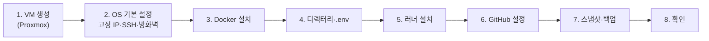

# 운영 환경 VM 준비 가이드 (Proxmox + Docker + Actions runner)

> 버전 0.1 · 2026-10-07 · 로드맵 [1-11](../03-roadmap/part1-foundation.md)의 "0) VM 준비" 절차. 결정 근거는 [ADR-011](../adr/ADR-011-ops-practice-environment.md).
> 이 문서의 명령은 **직접 실행해 검증한 것이 아니다.** 버전·메뉴 이름·옵션은 각 공식 문서와 대조하고, 다르면 이 문서를 고치게 알려 달라. 확인하지 못한 곳은 "확인 필요"로 표시했다.

## 0. 전체 순서



## 1. VM 생성 (Proxmox)

| 항목 | 값 | 이유 |
|---|---|---|
| 이름 | `myroutine-ops` | |
| OS | Ubuntu Server LTS (확인 필요: 설치 시점의 최신 LTS) | Docker·GitHub 러너가 공식 지원 |
| vCPU | 8~10, CPU 타입 `host` | 호스트 16코어 중 일부는 Proxmox와 다른 VM용으로 남긴다 |
| RAM | 약 20GB, **Ballooning 끔** | ES·Kafka가 메모리를 한 번에 잡는다. 줄었다 늘었다 하면 OOM 원인이 된다. 실사용량은 7-1(ELK) 때 측정해서 조정 |
| 디스크 | 100GB, VirtIO SCSI, (SSD면) Discard 켬 | 이미지·Postgres·ES·MinIO 볼륨 |
| 네트워크 | VirtIO, 브릿지 `vmbr0` | 집 LAN에서 바로 접근 |
| QEMU Guest Agent | 옵션에서 켬 | Proxmox가 IP 확인·안전한 종료·스냅샷을 할 수 있다 |

- 이 VM은 **이 프로젝트 전용**으로 쓴다. 러너의 docker 권한은 사실상 root라서 다른 중요한 데이터를 같이 두지 않는다(ADR-011 §3).
- 나중에 쿠버네티스로 가면 이 VM을 그대로 쓰지 않고 **새 VM을 만드는 쪽**이 자연스럽다(아래 §9). 그래서 지금 VM에 Proxmox 스냅샷을 잘 남겨 둔다.

## 2. OS 기본 설정

**2-1. 고정 IP**
- 공유기에서 VM의 MAC 주소에 **DHCP 예약**으로 고정 IP를 준다(VM 안에서 정적 설정을 하지 않아도 되고, 나중에 IP를 바꾸기 쉽다). 이 IP를 문서에서 `{VM_IP}`라고 부른다.
- `STORAGE_ENDPOINT`·`STORAGE_PUBLIC_BASE_URL`·프론트의 API 주소가 이 IP를 쓰므로 **바뀌면 안 된다**.

**2-2. 사용자와 SSH**
```bash
# 설치할 때 만든 관리용 사용자(예: admin)로 접속해서
sudo adduser --disabled-password --gecos "" runner      # 러너 전용 비root 사용자
```
- 내 PC의 공개키를 `admin`의 `~/.ssh/authorized_keys`에 넣고, `/etc/ssh/sshd_config`에서 `PasswordAuthentication no`로 바꾼 뒤 `sudo systemctl restart ssh`. (키로 접속되는 것을 **다른 터미널에서 먼저 확인한 다음** 비밀번호 로그인을 끈다.)
- `runner`는 SSH 접속용이 아니다. 비밀번호도 없고 sudo 권한도 주지 않는다.

**2-3. 시스템 기본**
```bash
sudo apt update && sudo apt -y upgrade
sudo apt -y install qemu-guest-agent unattended-upgrades ufw
sudo systemctl enable --now qemu-guest-agent
sudo timedatectl set-timezone Asia/Seoul        # 로그 시각을 KST로 보려는 경우. 앱은 UTC로 저장한다(개발 가이드 §5.5)
```

**2-4. 방화벽 (ufw)**
```bash
sudo ufw default deny incoming
sudo ufw default allow outgoing
sudo ufw allow from 192.168.0.0/16 to any port 22 proto tcp     # 확인 필요: 내 LAN 대역으로 바꾼다 (예: 192.168.0.0/24)
sudo ufw allow from 192.168.0.0/16 to any port 8080 proto tcp
sudo ufw allow from 192.168.0.0/16 to any port 9000 proto tcp
sudo ufw enable
```
> ⚠ **Docker가 publish한 포트는 ufw 규칙을 우회한다**(Docker가 iptables를 직접 건드린다. 확인 필요: 현재 동작은 Docker 문서의 "Packet filtering and firewalls" 참고). ufw만 믿지 말고, **compose에서 아예 publish하지 않는 것**이 1차 방어다(1-11 정책: Postgres·8081·MinIO 콘솔은 publish 없음). ufw는 2차 방어다.

## 3. Docker 설치

Docker 공식 문서의 "Install Docker Engine on Ubuntu → Install using the apt repository" 절차를 그대로 따른다(저장소 키 등록 → `apt install docker-ce docker-ce-cli containerd.io docker-buildx-plugin docker-compose-plugin`). 배포판 기본 저장소의 `docker.io` 패키지가 아니라 **공식 저장소**를 쓴다.

```bash
sudo usermod -aG docker runner            # 러너가 docker를 쓰게 (docker 그룹 = 사실상 root, §1 참고)
sudo systemctl enable docker              # 재부팅 후 자동 시작
```

로그가 디스크를 채우지 않게 `/etc/docker/daemon.json`:
```json
{ "log-driver": "json-file", "log-opts": { "max-size": "10m", "max-file": "3" } }
```
`sudo systemctl restart docker` 후 확인:
```bash
docker version && docker compose version
sudo -u runner docker ps            # 권한 확인 (목록이 비어 있어도 에러가 없으면 된다)
```

## 4. 배포 디렉터리와 `.env`

```bash
sudo mkdir -p /opt/myroutine
sudo chown runner:runner /opt/myroutine
sudo chmod 750 /opt/myroutine
sudo -u runner touch /opt/myroutine/.env && sudo chmod 600 /opt/myroutine/.env
```

- `/opt/myroutine/.env`를 `runner` 사용자 권한으로 편집한다. **키 이름은 리포의 `.env.ops.example`이 기준**이다(1-11에서 사용자가 만든다). 들어가야 하는 값의 종류:

| 종류 | 예시 키 (확인 필요: 실제 이름은 `.env.ops.example`) | 값 만드는 법 |
|---|---|---|
| DB | `POSTGRES_USER`, `POSTGRES_PASSWORD`, `POSTGRES_DB` | 비밀번호: `openssl rand -base64 32` |
| JWT 서명 키 | `JWT_SECRET` 등 | `openssl rand -base64 48` |
| MinIO | `MINIO_ROOT_USER`, `MINIO_ROOT_PASSWORD` | 비밀번호: `openssl rand -base64 32` |
| 저장소 주소 | `STORAGE_ENDPOINT=http://{VM_IP}:9000`, `STORAGE_PUBLIC_BASE_URL=http://{VM_IP}:9000/myroutine` | **컨테이너 내부 주소를 쓰지 않는다**(presigned URL 때문. 1-11 §3) |
| CORS | `CORS_ALLOWED_ORIGINS=http://{프론트 주소}` | `*` 금지 |

- 이 파일은 **리포·GitHub Secrets·이미지·채팅·이슈에 붙이지 않는다.** 비밀번호 관리자나 NAS의 암호화 폴더에 백업해 둔다.
- `/opt/myroutine/deployed-sha`는 배포 스크립트가 만든다. 직접 만들지 않는다.

## 5. GitHub Actions 러너 설치

> 러너 등록 토큰은 **짧은 시간만 유효**하다(확인 필요: 만료 시간). 화면을 연 채로 바로 진행한다.

1. GitHub 리포 → **Settings → Actions → Runners → New self-hosted runner** → OS `Linux`, 아키텍처 `x64`(VM에 맞게). 화면에 나오는 다운로드·설정 명령이 **최신 기준**이다. 아래는 흐름만 요약.
2. `runner` 사용자로 전환해서 진행한다(`sudo -iu runner`).
```bash
mkdir ~/actions-runner && cd ~/actions-runner
# 화면의 curl/tar 명령으로 내려받고 압축을 푼다 (체크섬 검증 포함)
./config.sh --url https://github.com/{owner}/{repo} --token {화면의 토큰} --labels ops --name myroutine-ops
```
   - 러너 그룹, 작업 폴더는 기본값. 라벨은 워크플로의 `runs-on: [self-hosted, ops]`와 같아야 한다.
3. **서비스로 등록**한다(재부팅 후 자동 시작). `admin` 사용자로 돌아와서:
```bash
cd /home/runner/actions-runner
sudo ./svc.sh install runner      # 확인 필요: 인자는 서비스를 실행할 사용자
sudo ./svc.sh start
sudo ./svc.sh status
```
4. GitHub의 Runners 목록에서 `myroutine-ops`가 **Idle**이면 성공.

보안 점검(ADR-011 §3):
- `ps -o user= -p $(pgrep -f Runner.Listener | head -1)` 결과가 `runner`(root 아님)
- `runner`는 sudo 불가: `sudo -l -U runner`에 허용 명령이 없다

## 6. GitHub 저장소 설정 (public 리포 필수)

| 위치 | 설정 |
|---|---|
| Settings → Environments → **New environment `ops`** | **Deployment branches**를 "Selected branches"로 `develop`, `main`만 허용 |
| Settings → Actions → General → Fork pull request workflows | 외부 기여자의 워크플로 실행에 **승인 필요**로 설정 (확인 필요: 메뉴 문구) |
| Settings → Actions → General → Workflow permissions | 기본은 **Read** 권한. 이미지 push가 필요한 job에서만 `packages: write`를 워크플로에 명시 |
| 워크플로 파일 | `self-hosted` job이 `pull_request` 이벤트로 실행되지 않는지 확인 (1-11 완료 확인) |
| Packages(GHCR) | 첫 이미지가 올라간 뒤 패키지 설정에서 리포와의 연결·가시성·접근 권한 확인 (확인 필요) |

## 7. 스냅샷과 백업

- **기본 스냅샷**: §2~5를 마치고 앱을 올리기 전에 Proxmox에서 스냅샷 `base-ready`를 만든다. 설정이 꼬이면 여기로 돌아온다.
- **VM 백업**: Proxmox의 백업(vzdump)을 주기 실행으로 건다. 저장 위치로 시놀로지 NAS(NFS/SMB 스토리지로 Proxmox에 연결)를 쓸 수 있다(확인 필요: Proxmox의 스토리지 추가 메뉴). 백업 안에는 Postgres·MinIO 볼륨(= 데이터)과 `.env`가 들어 있으므로 **NAS 접근 권한을 제한**한다.
- Stage 1의 DB 백업(`pg_dump` 등)은 범위 밖이다. VM 백업이 대신하고 회고에 남긴다(ADR-011 §6).

## 8. 준비 완료 확인

| 확인 | 방법 |
|---|---|
| [ ] 고정 IP | VM 재부팅 후에도 `{VM_IP}`가 같다 |
| [ ] SSH | 키로만 접속, 비밀번호 접속은 거부된다 |
| [ ] Docker | `sudo -u runner docker run --rm hello-world` 성공 |
| [ ] `.env` | `ls -l /opt/myroutine/.env` → `-rw------- runner runner` |
| [ ] 러너 | GitHub에서 Idle, VM을 재부팅해도 자동으로 Idle로 돌아온다 |
| [ ] 러너 권한 | root가 아닌 `runner`로 실행 중, sudo 불가 |
| [ ] 환경 | GitHub Environment `ops`의 배포 브랜치가 제한돼 있다 |
| [ ] 스냅샷 | `base-ready` 스냅샷이 있다 |

이 목록을 통과하면 1-11의 "1) 앱 이미지"부터 진행한다.

## 9. 이후: 쿠버네티스로 가게 되면

최종 목표는 쿠버네티스(k3s)와 무중단 배포다([ADR-011 §진화 경로](../adr/ADR-011-ops-practice-environment.md)). 이 VM에서 미리 지켜 두면 나중에 편한 것:
- **새 VM을 만들고 이 VM은 compose 환경으로 남긴다.** 쿠버네티스와 compose를 한 VM에 섞으면 포트·리소스 충돌과 디버깅 혼란이 생긴다. Proxmox라서 VM 추가가 쉽다. 이 VM을 템플릿으로 만들어 두면(§2~3까지 끝난 상태) 복제로 시작할 수 있다.
- 포트(8080)와 헬스체크 경로를 compose와 같은 값으로 유지해 둔다. 이후 readiness/liveness probe에 그대로 쓰인다.
- 이미지는 계속 sha 태그로 만든다. 같은 이미지가 compose와 쿠버네티스에서 모두 쓰인다.
